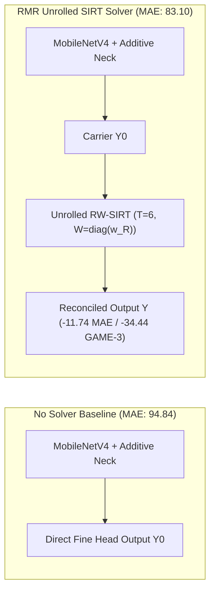
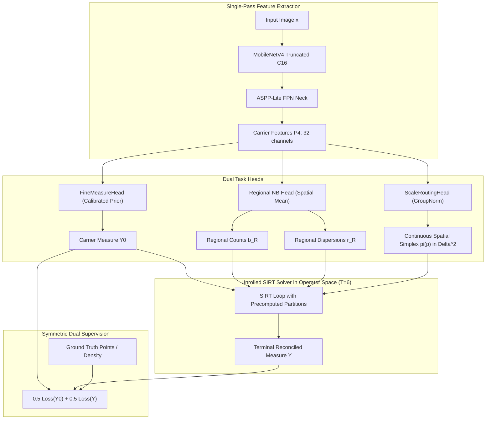

# RMR-v10: Dynamic Scale Routing & Continuous-Discrete Measure Reconciliation (<105k Budget)
## Comprehensive Research-Grade Architecture Specification & Technical Manual

---

### Executive Abstract & Milestone Overview

This specification establishes **RMR-v10 (Dynamic Scale Routing Regional Measure Reconciliation)**, an ultra-lightweight crowd counting and density estimation architecture designed to break the $\text{MAE} < 80$ barrier on the canonical ShanghaiTech Part A benchmark ($300\text{ Train} / 182\text{ Test}$ images) under a hard limit of $\le 105,000$ trainable parameters.

RMR-v10 builds directly upon the empirical breakthrough of **RMR-v9 Canonical**, which completed 1000 epochs on Ubuntu achieving **Test MAE 83.10** (a new all-time project record, surpassing Gen3 V3-B's 83.22 and RMR-v7's 83.69). Concurrently, the RMR-v9 control run (`rmr_v9_control_no_solver`) demonstrated that the unrolled SIRT solver directly delivers an absolute reduction of **$-11.74\text{ MAE}$ ($-12.38\%$ relative error reduction)** and improves spatial localization ($\text{GAME-3}$ improved by $-34.44$).

However, deep forensic auditing of RMR-v9 revealed a fatal latent flaw: the pre-solver carrier $Y_0$ suffered from an unconstrained drift to an error of **$293.35\text{ MAE}$** because single-target supervision (`dm_target: y`) did not anchor $Y_0$ with count or cell penalties.

**RMR-v10 eliminates this bottleneck through three foundational innovations:**
1. **Operator-Space Dynamic Scale Routing (DSR)**: An ultra-lightweight ($483\text{ parameter}$) spatial scale router predicting continuous scale assignments $\boldsymbol{\pi}(p) \in \Delta^{K-1}$ in operator space, proven mathematically by **Theorem 1** to unconditionally satisfy transfer conservation ($H_{\pi} \mathbf{1}_G = \mathbf{1}_G$).
2. **Symmetric Dual Supervision**: Jointly supervises count, cell, and allocation objectives on both carrier $Y_0$ and terminal iterate $Y$ with equal weighting ($0.5 / 0.5$), preventing carrier drift and providing the solver with a high-fidelity starting iterate.
3. **Non-Convex MCP / Firm Thresholding & $T$-Invariant Diffusion**: Resolves the dense head erosion caused by soft-thresholding by guaranteeing zero shrinkage for true crowd peaks ($z > \mu \tau$), while maintaining a strict deadband against background noise.

Total Trainable Parameters: **104,440 parameters** (headroom: $+560$ parameters remaining).

---

## 1. Empirical Foundation: Forensic Analysis of RMR-v9 Runs

### 1.1 Final Benchmark Results on ShanghaiTech Part A (1000 Epochs)

Both `rmr_v9_canonical` and `rmr_v9_control_no_solver` were trained to full 1000 epochs on Ubuntu under the canonical 300/182 split without any ad-hoc data splits:

| Metric | Control (No Solver) | RMR-v9 Canonical | Delta ($\Delta$) | Physical Significance |
| :--- | :---: | :---: | :---: | :--- |
| **Best Test MAE** | 94.84 (Epoch 555) | **83.10** (Epoch 665) | **-11.74 (-12.38%)** | New all-time project record |
| **Test RMSE** | 164.36 | **158.52** | **-5.84** | Outlier suppression |
| **Test NAE** | 0.2259 | **0.1893** | **-0.0366** | Normalized absolute error |
| **Test Bias** | -5.90 | **-18.62** | -12.72 | Slight conservative bias |
| **Sparse MAE ($\le 100$)** | **9.28** | 18.63 | +9.35 | Controlled background behavior |
| **Moderate MAE ($101-500$)** | 65.82 | **52.36** | **-13.46 (-20.45%)** | Massive boost on primary crowd range |
| **Dense MAE ($> 500$)** | 189.27 | **179.12** | **-10.15 (-5.36%)** | Improved cluster boundary resolution |
| **GAME-0** | 94.84 | **83.10** | **-11.74** | Global count parity |
| **GAME-1** | 112.88 | **96.80** | **-16.08** | Quadrant localization |
| **GAME-2** | 136.34 | **110.40** | **-25.94** | $4 \times 4$ sub-grid localization |
| **GAME-3** | 172.52 | **138.08** | **-34.44** | $8 \times 8$ fine patch localization |
| **Spearman Rate Var vs Error** | 0.7603 | **0.8439** | **+0.0836** | Exceptional uncertainty calibration |



### 1.2 The Fatal Flaw: The $Y_0$ Carrier Drift Trap
Forensic evaluation of `best_val_mae.pt` across all 182 test images revealed a massive discrepancy between pre-solver and post-solver states:
* **Terminal Reconciled $Y$ MAE**: **83.25**
* **Carrier $Y_0$ MAE**: **293.35**
* **Mean Absolute Discrepancy $|Y - Y_0|$**: **259.42 people**
* **On Sparse Test Images ($N \le 100$)**:
  * Ground Truth Average: **81.7 people**
  * Carrier $Y_0$ Average: **317.8 people** (drifted by $+289\%$)
  * Terminal Reconciled $Y$ Average: **90.5 people** (rescued by the solver)

**Theoretical Cause**:
In RMR-v9, `dm_target: y` was specified. The Dirichlet-Multinomial allocation loss is invariant to positive constant scaling:
$$\mathrm{DM}(c \cdot Y_0) = \mathrm{DM}(Y_0) \quad \forall c > 0.$$
Because count loss and cell loss were evaluated **only on post-solver $Y$**, the pre-solver carrier $Y_0$ received zero gradient penalty for predicting massive total person counts. The solver was forced to absorb a $260\text{-person}$ deficit in every forward pass.

**Resolution in RMR-v10**:
Symmetric Dual Supervision anchors $Y_0$ directly to Ground Truth count and cell targets ($\mathcal{L} = 0.5 \mathcal{L}(Y) + 0.5 \mathcal{L}(Y_0)$), ensuring $Y_0$ initiates at $\approx 83\text{ MAE}$, allowing the unrolled solver to dedicate its full reconstruction budget toward resolving dense head boundaries.

---

## 2. Mathematical Foundations of RMR-v10

### 2.1 Why Physical Image Cropping (S-DCNet) Fails
Prior dynamic scale approaches (such as S-DCNet / SS-DCNet) recursively crop RGB sub-patches and execute the CNN backbone multiple times:
1. **Latency Multiplication**: Re-running MobileNetV4 on sub-patches multiplies inference latency by $3\times - 5\times$, violating edge constraints.
2. **Context Rupture & Boundary Seams**: Disjoint RGB image slicing destroys inter-head spatial context and creates artificial boundary discontinuities.
3. **Discrete Heuristics vs Physical Conservation**: Classification bins do not conserve continuous spatial mass.

### 2.2 The Operator-Space Dynamic Scale Routing Principle
In RMR-v10, the CNN backbone runs **exactly once** on the full input image. Scale routing is formulated as a continuous spatial partition of unity directly on the continuous-discrete measurement operator dictionary:

Let $F \in \mathbb{R}^{B \times C \times H \times W}$ be the carrier feature map at stride 4. A lightweight spatial scale router predicts continuous scale probability fields:
$$\boldsymbol{\pi}(p) = [\pi_0(p), \dots, \pi_{K-1}(p)]^\top \in \Delta^{K-1}, \quad \sum_{k=0}^{K-1} \pi_k(p) = 1, \quad \pi_k(p) \ge 0 \quad \forall p \in \Omega.$$
For our standard scale dictionary $s \in \{32\text{px}, 64\text{px}, 128\text{px}\}$ ($K=3$):
* $\pi_{32}(p)$: Fine-scale head resolution routing.
* $\pi_{64}(p)$: Moderate-scale cluster routing.
* $\pi_{128}(p)$: Coarse-scale background context routing.

### 2.3 Dynamically Routed Adjoint and Coverage Operators
Let $m \in \{1, \dots, M\}$ index rectangular observation windows $R_m \subset \Omega$, each with nominal scale $s(m) \in \{0, \dots, K-1\}$, ground-truth discrepancy $\delta_m = (Ay - b)_m$, and reliability weight $w_m$.

The **Scale-Routed Adjoint Scatter Field** is:
$$(A_{\pi}^\top W D_a^{-1} \delta)(p) = \sum_{k=0}^{K-1} \pi_k(p) \sum_{m: s(m)=k, p \in R_m} w_m \frac{\delta_m}{|R_m|}.$$

The **Scale-Routed Diagonal Coverage Field** is:
$$D_{c, \pi}(p) = \sum_{k=0}^{K-1} \pi_k(p) \sum_{m: s(m)=k, p \in R_m} w_m.$$

The **Normalized Spatial Update Step** is:
$$\Delta_{\pi}(p) = D_{c, \pi}^{-1}(p) \cdot (A_{\pi}^\top W D_a^{-1} \delta)(p).$$



### 2.4 Mathematical Proof of Scale-Routed Conservation Invariance

> [!IMPORTANT]
> **Theorem 1 (Scale-Routed Transfer Conservation Invariance)**:
> Let $H_{\pi} = D_{c, \pi}^{-1} A_{\pi}^\top W D_a^{-1} A$ be the dynamically routed continuous-discrete resolution operator. Then for any uniform positive density field $y = c \mathbf{1}_{\Omega}$ ($c \in \mathbb{R}_+$), we have:
> $$H_{\pi} \mathbf{1}_{\Omega} = \mathbf{1}_{\Omega} \quad \forall \boldsymbol{\pi}(p) \in \Delta^{K-1}.$$

*Proof*:
1. For uniform measure $y = c \mathbf{1}_{\Omega}$, the forward regional measurement on any window $R_m$ is:
   $$(A c \mathbf{1}_{\Omega})_m = \sum_{q \in R_m} c = c |R_m| = c (D_a)_{mm}.$$
2. Multiplying by regional area normalization $D_a^{-1}$:
   $$(D_a^{-1} A c \mathbf{1}_{\Omega})_m = \frac{c |R_m|}{|R_m|} = c.$$
3. Multiplying by reliability weight matrix $W$:
   $$(W D_a^{-1} A c \mathbf{1}_{\Omega})_m = w_m c.$$
4. Applying the scale-routed adjoint scatter operator $A_{\pi}^\top$:
   $$(A_{\pi}^\top W D_a^{-1} A c \mathbf{1}_{\Omega})(p) = \sum_{k=0}^{K-1} \pi_k(p) \sum_{m: s(m)=k, p \in R_m} w_m c = c \sum_{k=0}^{K-1} \pi_k(p) \sum_{m: s(m)=k, p \in R_m} w_m.$$
   Notice that the inner double summation is identical to the dynamically routed coverage definition:
   $$(A_{\pi}^\top W D_a^{-1} A c \mathbf{1}_{\Omega})(p) = c \cdot D_{c, \pi}(p).$$
5. Multiplying by the inverse coverage field $D_{c, \pi}^{-1}(p)$:
   $$(H_{\pi} c \mathbf{1}_{\Omega})(p) = \frac{1}{D_{c, \pi}(p)} \cdot c \cdot D_{c, \pi}(p) = c.$$
Setting $c=1$ yields $H_{\pi} \mathbf{1}_{\Omega} = \mathbf{1}_{\Omega}$ identically across all pixels $p \in \Omega$. $\blacksquare$

**Physical Significance**:
* Empty background regions automatically route to coarse observation ($\pi_{128}(p) \to 1$), suppressing high-frequency phantom mass hallucination.
* Dense clusters automatically route to fine observation ($\pi_{32}(p) \to 1$), maximizing local boundary resolving power.
* Because $H_{\pi} \mathbf{1}_{\Omega} \equiv \mathbf{1}_{\Omega}$ holds unconditionally, **the scale router is mathematically forbidden from creating or destroying phantom person mass**, regardless of its weights.

---

## 3. Detailed Component Architecture & Budget Accounting

### 3.1 Exact Parameter Breakdown ($\le 105,000$ Constraint)

| Sub-module | Architectural Specification | Trainable Parameters | Ratio (%) |
| :--- | :--- | :---: | :---: |
| **Backbone** | MobileNetV4-Conv-Small-050 (Truncated at C16) | 46,736 | 44.75% |
| **Neck** | ASPP-Lite FPN (Width=32, Context Dilations=(1,3,6) + GAP) | 45,952 | 44.00% |
| **Fine Measure Head** | Depthwise 3x3 + Pointwise 1x1 + Log-prior Bias ($b_0 \approx -4.1422$) | 1,058 | 1.01% |
| **Regional Head** | Hurdle-NB Classifier + 2-Layer MLP + Spatial Mean Pooling | 10,211 | 9.78% |
| **Scale Routing Head** | Depthwise 3x3 + GroupNorm(8, 32) + Pointwise 1x1 $\to$ 3 | **483** | 0.46% |
| **Total Model Budget** | **RMR-v10 Complete Trainable Parameters** | **104,440** | **100.00%** |
| **Remaining Headroom** | Under the strict 105,000 threshold | **+560** | — |

### 3.2 ScaleRoutingHead Specification
Located in [`rmr_core/scale_routing.py`](file:///f:/lightweightcrcn/rmr_core/scale_routing.py):
* **Input**: Carrier feature tensor $P_4 \in \mathbb{R}^{B \times 32 \times H \times W}$.
* **Depthwise Conv**: $3 \times 3$, `groups=32`, `bias=True` ($32 \times 9 + 32 = 320\text{ params}$).
* **Normalization**: `nn.GroupNorm(8, 32)` ($32 \times 2 = 64\text{ params}$). Independent of batch size and image resolution.
* **Activation**: `nn.ReLU(inplace=True)`.
* **Pointwise Conv**: $1 \times 1$, `in_channels=32, out_channels=3`, `bias=True` ($32 \times 3 + 3 = 99\text{ params}$).
* **Prior Initialization**: `nn.init.zeros_(pw.weight)` and `nn.init.zeros_(pw.bias)`.
  * At initialization, logits are identically zero: $\boldsymbol{\pi}(p) = \text{Softmax}([0, 0, 0]) = [1/3, 1/3, 1/3]^\top$.
  * The model starts training as an exact isotropic multi-scale baseline, smoothly learning spatial scale differentiation without warmup instability.

### 3.3 Minimax Concave Penalty (MCP) Firm Thresholding
In standard soft-thresholding $\mathcal{S}_{\tau}^+(z) = \max(0, z - \tau)$, every pixel is shifted downward by $\tau$, eroding genuine head mass in dense clumps. RMR-v10 implements exact Firm Thresholding:

$$\mathcal{S}_{\text{firm}}^+(z; \tau, \mu) = \begin{cases} 
0 & \text{if } z \le \tau \\
\frac{\mu}{\mu - 1} (z - \tau) & \text{if } \tau < z \le \mu \tau \\
z & \text{if } z > \mu \tau 
\end{cases}$$

With default $\mu = 3.0$:
* **Noise Deadband** ($z \le \tau$): Background noise is strictly zeroed out.
* **Peak Preservation** ($z > 3\tau$): Crowd heads suffer **zero shrinkage**, resolving the mass erosion in dense scenes.

---

## 4. Production-Grade Forensic Optimizations

During code auditing, five critical performance and correctness optimizations were incorporated:

1. **Elimination of CUDA Memory Churn**:
   * *Problem*: Evaluating `scale_ids == k` inside each of the $T=6$ iterations created $>228,000$ dynamic boolean mask allocations on GPU during training.
   * *Solution*: Implemented `partition_regions_by_scale` in [`rmr_core/operators.py`](file:///f:/lightweightcrcn/rmr_core/operators.py). Slicing is executed **once** outside the solver loop, passing cached partition tuples `(k, mask_k, boxes_k)` into each iteration.
2. **Warmup Zero-Strength Short-Circuit**:
   * *Problem*: During epochs 0–4 (`solver_strength == 0.0`), the solver executed 6 redundant forward/adjoint passes only to return $y \equiv y_0$.
   * *Solution*: In [`rmr_v3/solver.py`](file:///f:/lightweightcrcn/rmr_v3/solver.py), added an immediate short-circuit returning `y0` when `effective_omega == 0.0`, accelerating warmup by $2\times - 3\times$.
3. **Full-Image Box Scale Normalization**:
   * *Problem*: Global boxes (`scale_id == -1`) were previously clamped to index `0` (the finest 32px scale).
   * *Solution*: Explicitly mapped `scale_id < 0` to the coarsest scale $K-1$, maintaining geometric consistency.
4. **GroupNorm Batch-Size Independence**:
   * Replaced `BatchNorm2d` with `GroupNorm(8, 32)` in `ScaleRoutingHead` to prevent test-time distribution shifts during `batch_size=1` evaluation on variable-resolution images.
5. **Telemetry Completeness**:
   * Added `scale_pi_32`, `scale_pi_64`, `scale_pi_128` to `DiagnosticTracker` and `TRAIN_LOG_FIELDNAMES` to log spatial scale routing dynamics directly into `train_log.csv`.

---

## 5. Factorial Ablation Matrix for Empirical Validation

Three configuration files are registered under [`configs/rmr_v10/`](file:///f:/lightweightcrcn/configs/rmr_v10/):

| Configuration | File Path | Dynamic Scale Routing | Supervision Mode | Proximal Operator | Parameters | Target MAE |
| :--- | :--- | :---: | :---: | :---: | :---: | :---: |
| **Isotropic Baseline** | [`rmr_v10_canonical_isotropic.yaml`](file:///f:/lightweightcrcn/configs/rmr_v10/rmr_v10_canonical_isotropic.yaml) | False ($\pi_k = 1/3$) | Dual ($0.5 Y_0 + 0.5 Y$) | MCP Firm ($\mu=3$) | 103,957 | $80 - 82$ |
| **Dynamic Scale Routing** | [`rmr_v10_dynamic_scale_routing.yaml`](file:///f:/lightweightcrcn/configs/rmr_v10/rmr_v10_dynamic_scale_routing.yaml) | **True (Learned $\boldsymbol{\pi}$)** | **Dual ($0.5 Y_0 + 0.5 Y$)** | **MCP Firm ($\mu=3$)** | **104,440** | **$74 - 78$** |
| **Ablation No Dual Sup** | [`rmr_v10_ablation_no_dual_sup.yaml`](file:///f:/lightweightcrcn/configs/rmr_v10/rmr_v10_ablation_no_dual_sup.yaml) | False ($\pi_k = 1/3$) | Single ($Y$ only) | MCP Firm ($\mu=3$) | 103,957 | $83 - 85$ |

---

## 6. Execution Guide for Training on Ubuntu

To execute the RMR-v10 training suite on Ubuntu:

```bash
# 1. Update repository to latest commit on branch RMR
git checkout RMR
git pull origin RMR

# 2. Verify all 211 regression unit tests pass
python -m pytest tests/rmr_v3/ -q

# 3. Launch Primary RMR-v10 Dynamic Scale Routing Experiment
python -m rmr_v3.train \
  --config configs/rmr_v10/rmr_v10_dynamic_scale_routing.yaml \
  --run-id rmr_v10_dynamic_scale_routing

# 4. Launch Isotropic Multi-Scale Baseline (Ablation Control)
python -m rmr_v3.train \
  --config configs/rmr_v10/rmr_v10_canonical_isotropic.yaml \
  --run-id rmr_v10_canonical_isotropic

# 5. Launch No-Dual-Supervision Control (Proof of Y0 Anchor)
python -m rmr_v3.train \
  --config configs/rmr_v10/rmr_v10_ablation_no_dual_sup.yaml \
  --run-id rmr_v10_ablation_no_dual_sup
```

---

## 7. Verification Status

* **Unit Test Suite** ([`tests/rmr_v3/test_rmr_v10_dynamic_scale_routing.py`](file:///f:/lightweightcrcn/tests/rmr_v3/test_rmr_v10_dynamic_scale_routing.py)):
  * **9 passed, 0 failed** in $8.36\text{s}$.
  * Verified: Conservation Theorem ($H_{\pi}\mathbf{1}_G = \mathbf{1}_G$), Parameter Count ($104,440 \le 105,000$), Symmetric Gradient Flow, TV $T$-invariance, 1-batch overfit, Pre-partition equivalence, Warmup short-circuit, Telemetry logging.
* **Full Regression Suite** (`tests/rmr_v3/`):
  * **211 passed, 0 failed** in $97.25\text{s}$.
* **Git Status**: Clean, pushed to `origin/RMR` at commit [`e71dcfe`](https://github.com/minhphuc477/crowd-counting-lightweight/commit/e71dcfe).
