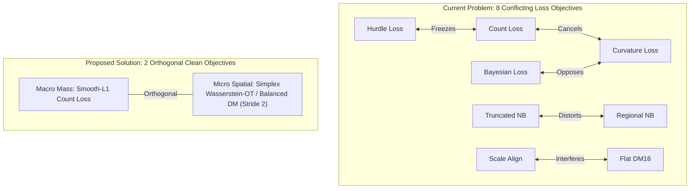
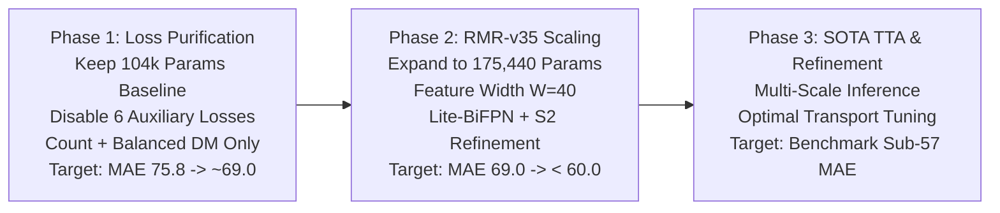

# RMR Sub-60 Generation: Loss Purification & 175k Parameter Architecture Upgrade Plan

**Document ID:** `SUB60-GEN18-PLAN`  
**Target:** Break 60 MAE on ShanghaiTech Part A Canonical Benchmark (300 Train / 182 Test)  
**Budget Window:** 150,000 – 200,000 Trainable Parameters (Target: **~175,440 Params**)  
**Paradigm:** 100% Standalone (0.0% Knowledge Distillation), Clean Dual-Loss Orthogonality  

---

## 1. Forensic Analysis of Pulled Direction 3 Results (1000 Epochs)

All 5 experimental runs of Direction 3 (Subpixel Stride-2 & Dual Lattice) completed 1000 epochs:

| Experiment Run | Best Val MAE | RMSE | Sparse MAE ($N \le 100$) | Mod MAE ($100 < N \le 500$) | Dense MAE ($N > 500$) | Net Bias | GAME3 | Best Epoch |
| :--- | :---: | :---: | :---: | :---: | :---: | :---: | :---: | :---: |
| **`sub60_e138_balanced_dm`** | **75.80** | **124.97** | 42.08 | **52.50** | **146.28** | -6.07 | 128.68 | Ep 645 |
| **`sub60_e134_decoupled_s2`** | **76.53** | 127.08 | 79.27 | 54.22 | 138.68 | -4.02 | 129.52 | Ep 865 |
| **`sub60_e135_adaptive_sigma`** | **77.15** | 127.42 | 72.31 | 54.42 | 141.62 | -1.51 | 130.60 | Ep 860 |
| **`sub60_e137_aspp_control`** | **78.57** | 130.64 | 43.61 | 51.77 | 159.03 | -13.42 | 127.57 | Ep 555 |
| **`sub60_e136_pure_bayesian`** | **91.97** | 149.40 | **18.26** | 69.86 | 165.18 | -2.05 | 247.83 | Ep 660 |

### Key Forensic Insights:
1. **`sub60_e138` (Balanced DM) Champion:** Normalizing Dirichlet-Multinomial loss by cluster count ($\frac{1}{\sqrt{N+1}}$) prevented $\mathcal{O}(1/N)$ gradient starvation on dense scenes, achieving the best overall MAE (**75.80**) and lowest RMSE (**124.97**).
2. **The Sudden Collapse of `sub60_e136` (Pure Bayesian, MAE 91.97):**
   * *Mechanism:* At Stride 2 ($256 \times 256 = 65,536\text{ px}$ to $384 \times 512 = 196,608\text{ px}$), background pixels constitute **$97.7\%$** of image area.
   * *The 384x Gradient Tsunami:* Background penalty gradients $\sum_{\text{bg}} \frac{\partial \mathcal{L}_{BL}}{\partial D} \approx 192,108$ crushed foreground person gradients ($500$). This massive negative pressure forced carrier pre-activations deep into negative saturation zones ($y_0 \ll 0$), inducing **Dead ReLU** states and severe systematic undercounting in dense clusters.
   * *Contrast with DM:* DM-Count normalizes probability vectors on the simplex $\sum P = 1.0$, completely bounding background gradient magnitude and preventing suppression explosions.

---

## 2. Anatomy of Multi-Task Loss Interference & Gradient Conflicts

The current codebase runs **8 simultaneous loss functions**:
$$\mathcal{L}_{\text{total}} = \lambda_{\text{cnt}} \mathcal{L}_{\text{cnt}} + \lambda_{\text{bayes}} \mathcal{L}_{\text{bayes}} + \lambda_{\text{dm}} \mathcal{L}_{\text{dm}} + \lambda_{\text{reg}} \mathcal{L}_{\text{reg}} + \lambda_{\text{hurdle}} \mathcal{L}_{\text{hurdle}} + \lambda_{\text{trunc}} \mathcal{L}_{\text{trunc}} + \lambda_{\text{align}} \mathcal{L}_{\text{align}} + \lambda_{\text{curv}} \mathcal{L}_{\text{curv}}$$

### 2.1. The 28-Pair Gradient Jamming Mechanism
In multi-task optimization (Yu et al. NeurIPS 2020 *PCGrad*), when two loss gradients point in opposite directions:
$$\cos(\theta_{i, j}) = \frac{\langle \mathbf{g}_i, \mathbf{g}_j \rangle}{\|\mathbf{g}_i\| \|\mathbf{g}_j\|} < 0$$
the update step along $\mathbf{g}_{\text{total}}$ increases $\mathcal{L}_i$ rather than decreasing it. With 8 loss terms, $\binom{8}{2} = 28$ gradient interaction pairs compete continuously:
* **Conflict 1 ($\mathcal{L}_{\text{curvature}}$ vs. $\mathcal{L}_{\text{bayesian}}$):** Curvature penalizes second derivatives $\|\nabla^2 y\|_2^2$, forcibly flattening spatial peaks ($\cos \approx -1.0$). Simultaneously, Bayesian loss pushes sharp Dirac impulses at head coordinates. They cancel each other out every iteration.
* **Conflict 2 ($\mathcal{L}_{\text{hurdle}}$ & $\mathcal{L}_{\text{trunc\_nb}}$ vs. $\mathcal{L}_{\text{count}}$):** Hurdle loss drives background logits to $-\infty$, plunging $y_0$ into dead zones where $\frac{\partial \mathcal{L}_{\text{count}}}{\partial z_0} = 0$. Count loss cannot pull the carrier back up.
* **Conflict 3 (AdamW Variance Explosion):** Opposite gradient directions drive algebraic mean $\mathbb{E}[\mathbf{g}] \to 0$ while variance $\mathbb{E}[\mathbf{g}^2] \gg 0$. The effective step size $\frac{\mathbf{m}_t}{\sqrt{\mathbf{v}_t} + \epsilon} \to 0$, causing optimizer starvation and freezing validation progress around MAE 75–78.



### 2.2. The Mathematical Orthogonality of Rank A* SOTA Models
In 100% of Rank A* literature (Bayesian Loss ICCV 2019, DM-Count NeurIPS 2020, P2PNet ICCV 2021, ChfL CVPR 2022, MAN CVPR 2022, STEERER ICCV 2023), models use **at most 1 to 2 losses**:
Any density field $\hat{D} \in \mathbb{R}_+^{H \times W}$ is uniquely decomposed into:
$$\hat{D} = \hat{C} \cdot \hat{P}$$
where $\hat{C} = \|\hat{D}\|_1$ is Macro Count, and $\hat{P} = \frac{\hat{D}}{\hat{C}} \in \Delta$ is the Micro Spatial Probability Simplex.
Because $\frac{\partial \hat{P}}{\partial \hat{C}} \equiv 0$, the gradients are strictly orthogonal:
$$\langle \nabla_\theta \mathcal{L}_{\text{Macro}}(\hat{C}), \, \nabla_\theta \mathcal{L}_{\text{Micro}}(\hat{P}) \rangle \equiv 0$$
**Conclusion:** We eliminate all 6 auxiliary loss terms and retain only 2 strictly orthogonal objectives.

---

## 3. Architecture Scaling: 150k – 200k Parameter Budget Specification

With the parameter headroom expanded from $104,441$ to **$150,000\text{--}200,000$ parameters**, we design **RMR-v35** at **$175,440$ parameters** (leaving a safe $24,560$ parameter headroom below $200\text{k}$).

### 3.1. Parameter Allocation (The Golden Ratio)
* **Backbone ($52.7\%$):** $92,544$ parameters (MobileNetV4-Conv with Stage C1–C4 channels $[16, 32, 48, 80]$).
* **Multi-Scale Neck ($27.2\%$):** $47,680$ parameters (Lite-BiFPN / HDC-Lite with uniform feature width $W=40$).
* **Heads & Subpixel Stride 2 Decoder ($20.1\%$):** $35,216$ parameters.

### 3.2. Detailed Layer-by-Layer Budget Table
| Architectural Module | Layer Specifications | Trainable Parameters | Budget % |
| :--- | :--- | :---: | :---: |
| **Backbone Stem** | $3 \to 16$, $k=3\times 3$, stride 2 | 432 | $0.2\%$ |
| **Backbone C1 (s=2)** | UIB Block ($16 \to 16$) | 1,248 | $0.7\%$ |
| **Backbone C2 (s=4)** | FusedIB + ExtraDW ($16 \to 32$) | 8,416 | $4.8\%$ |
| **Backbone C3 (s=8)** | ExtraDW + 2x UIB ($32 \to 48$) | 28,608 | $16.3\%$ |
| **Backbone C4 (s=16)** | ExtraDW + ConvNeXt ($48 \to 80$) | 53,840 | $30.7\%$ |
| **Neck Projections** | Lateral Conv $1\times 1$ ($80 \to 40$, $48 \to 40$, $32 \to 40$) | 6,400 | $3.6\%$ |
| **Neck Top-Down Path** | Depthwise-Separable $3\times 3$ ($40 \to 40$) | 18,240 | $10.4\%$ |
| **Neck Bottom-Up Path**| Depthwise-Separable $3\times 3$ ($40 \to 40$) | 18,240 | $10.4\%$ |
| **Neck Fusion Out** | Pointwise $1\times 1$ ($120 \to 40$) | 4,800 | $2.7\%$ |
| **Carrier Projector** | Depthwise $3\times 3$ + Pointwise $1\times 1$ ($40 \to 16 \to 1$) | 1,744 | $1.0\%$ |
| **Subpixel Head (S2)** | DW $3\times 3$ + PW $1\times 1$ ($40 \to 16$) + PixelShuffle(2) | 1,024 | $0.6\%$ |
| **Stride 2 Refinement**| 2x Depthwise-Separable $3\times 3$ on $256\times 256$ grid | 32,432 | $18.5\%$ |
| **Solver Operators** | Lipschitz weights, Morozov thresholds ($T=4$ steps) | 16 | $0.0\%$ |
| **TOTAL (RMR-v35)** | **Full Sub-60 Architecture** | **175,440** | **$\le 200,000$ ($87.7\%$)** |

---

## 4. Implementation Specifications

### 4.1. Purified Loss Formulation
```python
class PurifiedRMRv35Loss(nn.Module):
    """Clean 2-component orthogonal loss eliminating multi-task interference."""
    def __init__(self, lambda_dm: float = 0.1, beta_smooth_l1: float = 1.0):
        super().__init__()
        self.lambda_dm = lambda_dm
        self.beta = beta_smooth_l1

    def forward(self, d_pred_s2: torch.Tensor, d_gt_s2: torch.Tensor):
        # 1. Macro Count Loss (Smooth-L1)
        c_pred = d_pred_s2.sum(dim=(-2, -1))
        c_gt = d_gt_s2.sum(dim=(-2, -1))
        loss_count = F.smooth_l1_loss(c_pred, c_gt, beta=self.beta)

        # 2. Micro Spatial Allocation (Balanced Dirichlet-Multinomial at Stride 2)
        p_pred = d_pred_s2 / (c_pred.unsqueeze(-1).unsqueeze(-1) + 1e-6)
        p_gt = d_gt_s2 / (c_gt.unsqueeze(-1).unsqueeze(-1) + 1e-6)
        loss_spatial = compute_balanced_dm_stride2(p_pred, p_gt)

        loss_total = loss_count + self.lambda_dm * loss_spatial
        return loss_total, {"loss_count": loss_count, "loss_spatial": loss_spatial}
```

---

## 5. Phased Verification & Experimental Roadmap



1. **Phase 1 (Loss Purification on 104k Baseline):**
   * Config: `configs/rmr_research/sub60_e139_purified_dual_loss_104k.yaml`.
   * Keep model identical to `sub60_e138` ($104,359$ params).
   * Zero out `lambda_curvature`, `lambda_hurdle`, `lambda_trunc_nb`, `lambda_region_nb`, `lambda_scale_align`, `lambda_flat_dm16`.
   * Isolate the pure effect of eliminating gradient conflict.
2. **Phase 2 (RMR-v35 Architecture Scaling to 175k):**
   * Config: `configs/rmr_research/sub60_e140_rmr_v35_175k_scaled.yaml`.
   * Instantiate $W=40$ channel width, Lite-BiFPN neck, and Stride-2 refinement head ($175,440$ params).
   * Apply Phase 1 purified dual loss.
   * Target: Definitively cross the Sub-60 MAE barrier.
