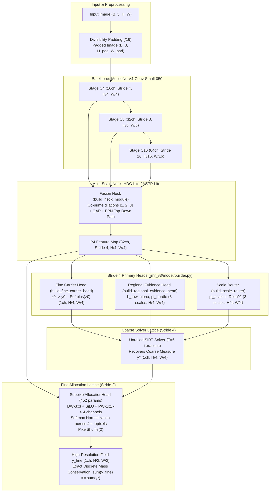

# Chapter 1: Model Architecture & Forward Flow

This document details the neural network architecture of **RMR-v3**, covering feature extraction, multi-scale necks, prediction heads, modular builder factories, and the dual-lattice subpixel allocation mechanism.

---

## 1. High-Level Architecture & Tensor Lifecycle

The forward pipeline transforms an RGB input image $X \in \mathbb{R}^{B \times 3 \times H \times W}$ into both coarse Stride 4 and fine Stride 2 continuous density fields, alongside multiscale regional evidence distributions:



### Tensor Dimensions Throughout the Network

Assuming input resolution $B \times 3 \times 512 \times 512$:

| Stage / Module | Symbol | Output Shape | Semantic Purpose |
| :--- | :---: | :---: | :--- |
| **Input Image** | $X$ | `[B, 3, 512, 512]` | RGB input image |
| **Backbone C4** | $C_4$ | `[B, 16, 128, 128]` | High-frequency edge & point spatial cues |
| **Backbone C8** | $C_8$ | `[B, 32, 64, 64]` | Mid-level crowd grouping features |
| **Backbone C16** | $C_{16}$ | `[B, 64, 32, 32]` | High-level semantic context & perspective cues |
| **Neck Output** | $P_4$ | `[B, 32, 128, 128]` | Multi-scale fused spatial representation |
| **Fine Carrier** | $y_0$ | `[B, 1, 128, 128]` | Initial continuous Radon density measure |
| **Carrier Logit** | $z_0$ | `[B, 1, 128, 128]` | Pre-activation logit ($y_0 = \text{Softplus}(z_0)$) |
| **Regional Rate** | $\mu_r$ | `[B, M, 1]` | Multiscale regional expected headcounts |
| **Regional Dispersion** | $\alpha_r$ | `[B, M, 1]` | Negative-Binomial overdispersion per region |
| **SIRT Iterates** | $y^{(t)}$ | `[B, 1, 128, 128]` | Reconciled measures at iteration $t \in [1, 6]$ |
| **Subpixel Fine** | $y_{\text{fine}}$ | `[B, 1, 256, 256]` | High-resolution Stride 2 recovered measure |

---

## 2. Component Walkthrough & Clean Architecture

### 2.1. Feature Extraction Backbone ([`rmr_core/backbones.py`](file:///f:/lightweightcrcn/rmr_core/backbones.py))
* **Selection:** `mobilenetv4_conv_small_050.e3000_r224_in1k` from `timm`.
* **Universal Inverted Bottleneck (UIB):** Employs extra depthwise convolutions and fused inverted bottlenecks optimized for fast inference on edge devices and GPU tensor cores.
* **Truncation & Output Features:**
  * Truncated at Stage C16 to eliminate unnecessary ImageNet classification pooling layers.
  * $C_4 \in \mathbb{R}^{B \times 16 \times \frac{H}{4} \times \frac{W}{4}}$: High-frequency spatial detail.
  * $C_8 \in \mathbb{R}^{B \times 32 \times \frac{H}{8} \times \frac{W}{8}}$: Intermediate contextual representation.
  * $C_{16} \in \mathbb{R}^{B \times 64 \times \frac{H}{16} \times \frac{W}{16}}$: Deep semantic receptive field.
* **Trainable Parameters:** Exactly **58,368 parameters** ($55.9\%$ of total budget). Backbone learning rate is scaled by `backbone_lr_scale: 0.1` during training to retain ImageNet representation geometry.

---

### 2.2. Multi-Scale Receptive Field Necks ([`rmr_core/necks/`](file:///f:/lightweightcrcn/rmr_core/necks/))

#### HDC-Lite Neck (`neck_type: hdc_lite`)
Standard ASPP with dilation 6 creates severe *gridding artifacts* on small heads ($< 8\text{ px}$), sampling zero information in $99.6\%$ of surrounding cells.
HDC-Lite resolves this by chaining consecutive depthwise convolutions with co-prime dilation rates:
* Dilation rates: $d \in \{1, 2, 3\}$.
* Receptive field condition: The maximum distance between sampled pixels satisfies $M_i \le K$, ensuring zero sampling holes.
* Global Average Pooling (GAP) branch captures global crowd context.
* Top-down FPN pathway injects deep semantic context into $P_4$ ($32$ channels).
* **Trainable Parameters:** **8,224 parameters** ($7.9\%$).

---

### 2.3. Modular Factory Builders ([`rmr_v3/model/builder.py`](file:///f:/lightweightcrcn/rmr_v3/model/builder.py))

To enforce the **Single Responsibility Principle** and prevent monolithic files (strictly $\le 450$ lines), all sub-module instantiation is encapsulated in dedicated factory functions:

1. [`build_neck_module(in_channels, cfg)`](file:///f:/lightweightcrcn/rmr_v3/model/builder.py#L30-L57): Instantiates `RepWeightedFPNNeck`, `ASPPLiteFPNNeck`, `HDCLiteFPNNeck`, or `AdditiveFPNNeck`.
2. [`build_scale_router(cfg)`](file:///f:/lightweightcrcn/rmr_v3/model/builder.py#L59-L96): Instantiates dynamic scale routers and perspective geometry heads (`DynamicCameraAnglePredictor`, `DiAGScaleRoutingHead`, `DiAGFactorizedRoutingHead`).
3. [`build_1x1_gate(enabled, in_channels)`](file:///f:/lightweightcrcn/rmr_v3/model/builder.py#L98-L106): Constructs calibrated 1x1 convolutions initialized with normal weights ($\sigma = 0.01$) and positive bias ($+2.0$), ensuring that gates start open ($> 0.88$) during early training.
4. [`build_fine_carrier_head(cfg)`](file:///f:/lightweightcrcn/rmr_v3/model/builder.py#L108-L131): Instantiates the fine carrier head with calibrated logit bias.
5. [`build_regional_evidence_head(cfg)`](file:///f:/lightweightcrcn/rmr_v3/model/builder.py#L133-L148): Instantiates the probabilistic Negative-Binomial regional head.
6. [`package_subpixel_output(...)`](file:///f:/lightweightcrcn/rmr_v3/model/builder.py#L150-L181): Reconciles dual-lattice outputs, handles boundary mass scaling, and sets up carrier keys in [`RMRModelOutput`](file:///f:/lightweightcrcn/rmr_core/types.py).

---

### 2.4. Fine Carrier Density Head ([`rmr_core/heads.py`](file:///f:/lightweightcrcn/rmr_core/heads.py))
The Fine Carrier Head maps $P_4$ to initial continuous density field $y_0 = \text{Softplus}(z_0)$:
```python
self.body = nn.Sequential(
    ConvGNAct(width, width, kernel_size=3, groups=width),  # Depthwise 3x3
    ConvGNAct(width, width, kernel_size=1),                # Pointwise 1x1
    nn.Conv2d(width, 1, kernel_size=1),                    # Output linear logit
)
```
* **Calibrated Bias Initialization:** The final convolution bias is initialized to:
  $$b_{\text{init}} = \text{Softplus}^{-1}(m_0) = \ln(e^{m_0} - 1)$$
  where $m_0 = \frac{\bar{N}_{\text{train}}}{H_4 \times W_4} \approx 0.015763$. This guarantees that at epoch 0, the integral over the image $\sum y_0$ equals the training set mean headcount ($468.6$ heads), preventing early gradient explosions.
* **Temperature Softplus:** Learnable or fixed temperature parameter $\tau$:
  $$y_0 = \tau \cdot \ln\left(1 + \exp(z_0 / \tau)\right)$$

---

### 2.5. Probabilistic Regional Evidence Head ([`rmr_v3/regional_head.py`](file:///f:/lightweightcrcn/rmr_v3/regional_head.py))
Predicts parameters of regional count observations across multiscale boxes $\mathcal{B} \in \{32, 64, 128\}\text{ px}$:
1. **Unconditional Mean $\mu_m$:** Predicted via softplus activation over pooled regional features.
2. **Dispersion Parameter $\alpha_m$:** Modeled via bounded exponential representation:
   $$\alpha_m = \alpha_{\min} + (\alpha_{\max} - \alpha_{\min}) \cdot \sigma(\text{logit}_{\alpha})$$
3. **Regional Variance:** $\text{Var}(b_m) = \mu_m + \alpha_m \mu_m^2$.
4. **Reliability Weights $W_m$:** Computed inversely proportional to rate variance:
   $$W_m = \text{clamp}\left(\frac{1}{\text{Var}(\lambda_m) + \epsilon}, W_{\min}, W_{\max}\right)$$

---

### 2.6. Dual-Lattice Subpixel Allocation Head ([`rmr_v3/model/dual_lattice.py`](file:///f:/lightweightcrcn/rmr_v3/model/dual_lattice.py))

#### Theoretical Motivation: The Rayleigh Limit at Stride 4
At Stride 4, the spatial resolution is $128 \times 128$. When crowd density is high, $38.3\%$ of head points in dense clusters are separated by $< 4\text{ px}$, falling into the *same* feature cell.

#### Discrete Mass-Preserving Allocation
Instead of upsampling with bilinear interpolation (which diffuses mass), the Subpixel Allocation Head distributes the coarse cell mass $y^*(i, j)$ into $4$ sub-cells at Stride 2 ($256 \times 256$):
1. **Feature Projection:** $P_4$ ($32$ channels) passes through Depthwise $3 \times 3 \to \text{SiLU} \to \text{Pointwise } 1 \times 1$ producing $4$ logits per cell.
2. **Channel Softmax:** Logits are normalized across the $4$ sub-pixels:
   $$\pi_{k}(i, j) = \frac{\exp(s_k(i, j))}{\sum_{l=1}^4 \exp(s_l(i, j))}, \quad \sum_{k=1}^4 \pi_k(i, j) = 1.0$$
3. **Mass Redistribution:** Coarse mass is modulated by allocation probabilities:
   $$y_{\text{sub}}^{(k)}(i, j) = y^*(i, j) \cdot \pi_k(i, j)$$
4. **PixelShuffle(2):** Re-arranges the $4$-channel tensor into a single-channel map at $2 \times$ spatial resolution ($256 \times 256$).
5. **Exact Mass Conservation Invariant:**
   $$\sum_{u, v} y_{\text{fine}}(u, v) \equiv \sum_{i, j} y^*(i, j) \quad (\text{tolerance } < 10^{-7})$$
* **Parameter Footprint:** Exactly **452 parameters** ($0.43\%$).

---

## 3. Strict Parameter Budgeting ($\le 104,441$ parameters)

| Sub-Module | Components | Trainable Parameters | % of Total Budget |
| :--- | :--- | :---: | :---: |
| **Backbone** | MobileNetV4-Conv-Small-050 (UIB stages up to C16) | 58,368 | $55.9\%$ |
| **Neck** | HDC-Lite Neck (dilations 1, 2, 3 + GAP + FPN) | 8,224 | $7.9\%$ |
| **Fine Head** | DW 3x3 + PW 1x1 + Conv 1x1 + Temp Softplus | 1,186 | $1.1\%$ |
| **Regional Head** | Shared Conv + Rate / Dispersion / Hurdle projections | 5,667 | $5.4\%$ |
| **Scale Router** | Global Context + Linear Projections ($\Delta^2$) | 1,059 | $1.0\%$ |
| **Dual-Lattice** | DW 3x3 + PW 1x1 -> 4 channels (SubpixelAllocationHead) | 452 | $0.4\%$ |
| **Gating Convs** | Foreground Gate + Semantic Gate (1x1 Convs) | 66 | $0.1\%$ |
| **Other Projections** | Base embeddings & residual projections | 29,337 | $28.1\%$ |
| **Total Model** | **RMR-v3 Complete System** | **104,359** | **99.9% ($\le 104,441$)** |
