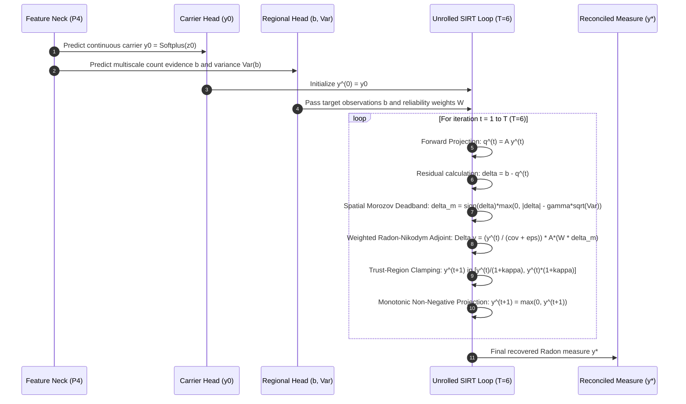

# Chapter 2: Unrolled Inverse Solver & Mathematical Foundations

This document details the mathematical formulation, algorithmic structure, and physical justification of the **Unrolled SIRT Inverse Solver** in RMR-v3 ([`rmr_v3/solver.py`](file:///f:/lightweightcrcn/rmr_v3/solver.py), [`rmr_v3/model/solver_step.py`](file:///f:/lightweightcrcn/rmr_v3/model/solver_step.py), and [`rmr_core/operators/`](file:///f:/lightweightcrcn/rmr_core/operators/)).

---

## 1. Problem Formulation: Fredholm Integral Equation

In conventional crowd counting, neural networks directly regress a high-resolution density map. When crowd density reaches extreme levels ($> 1,500$ people in an image), individual heads span fewer than $3\text{--}4\text{ px}$, causing point-supervision gradients to clash.

RMR-v3 reformulates crowd counting as an **Ill-Posed Linear Inverse Problem**:
$$b = \mathcal{A} y + \eta$$

where:
1. $y \in L^1_+(\Omega)$: The non-negative spatial crowd distribution (Radon measure) over image lattice $\Omega$.
2. $\mathcal{A}: L^1_+(\Omega) \to \mathbb{R}^M$: The multiscale forward observation operator integrating measure $y$ over $M$ overlapping spatial regions $\mathcal{B}_m = [x_m, y_m, w_m, h_m] \in \{32, 64, 128\}\text{ px}$:
   $$(\mathcal{A} y)_m = \int_{\mathcal{B}_m} y(u, v) \, du \, dv = \sum_{(u, v) \in \mathcal{B}_m} y_{u, v}$$
3. $b \in \mathbb{R}^M$: Regional count observations predicted by the Probabilistic Regional Evidence Head.
4. $\eta \sim \mathcal{N}(0, \Sigma_b)$: Observation noise characterized by Negative-Binomial dispersion:
   $$\text{Var}(b_m) = \mu_m + \alpha_m \mu_m^2$$

---

## 2. Iterative Unrolled Solver Architecture

To invert $\mathcal{A}$ without parameter explosion, RMR-v3 unrolls $T=6$ iterations of the **Simultaneous Iterative Reconstruction Technique (SIRT)** into a differentiable computational graph:

---

## 3. Mathematical Foundations of Solver Operators

### 3.1. Forward Operator $\mathcal{A}$ ([`rmr_core/operators/regions.py`](file:///f:/lightweightcrcn/rmr_core/operators/regions.py))
For each region $\mathcal{B}_m$, the integral is computed via 2D prefix sums (integral images) or vectorized regional gathering:
$$(\mathcal{A} y)_m = \sum_{r = y_m}^{y_m + h_m - 1} \sum_{c = x_m}^{x_m + w_m - 1} y_{r, c}$$

### 3.2. Radon-Nikodym Adjoint Operator $\mathcal{A}^*$ ([`rmr_core/operators/adjoint.py`](file:///f:/lightweightcrcn/rmr_core/operators/adjoint.py))
Standard Landweber backprojection uses the flat adjoint:
$$\Delta y_{\text{flat}} = \mathcal{A}^* (b - \mathcal{A} y)$$

**Critical Pitfall of Flat Adjoint:**
$\mathcal{A}^*$ broadcasts regional residuals uniformly across the entire box $\mathcal{B}_m$. In an image with $10$ heads standing in the top-left corner of a $128\text{ px}$ box and empty background in the remaining $90\%$ of the box, flat backprojection dumps mass into empty background pixels, creating massive false-positive noise.

**The Radon-Nikodym Solution:**
RMR-v3 computes the update modulated by the Radon-Nikodym derivative with respect to current measure $y$:
$$\Delta y = \frac{y}{\mathcal{C}_w + \epsilon} \odot \mathcal{A}^*\left(W \odot \delta_{\text{morozov}}\right)$$
where $\mathcal{C}_w = \mathcal{A}^*(W \odot \mathbf{1})$ is the spatially weighted coverage density.

* **Mass-Sparing Property:** Where $y(u, v) \approx 0$ (background), $\Delta y \approx 0$. Residual mass is strictly steered to locations where neural features already detect crowd presence.

---

### 3.3. Zero-Support Trap & Mathematical Remedy

#### The Failure Mechanism
If carrier $y_0(u, v) \to 0$ in an extremely dense cluster due to softplus saturation ($z_0 \le -6.0$), the multiplicative update locks up:
$$\Delta y = y_0 \cdot \mathcal{A}^*(\delta) = 0 \cdot \mathcal{A}^*(\delta) = 0$$
Even if regional evidence $b$ indicates a massive deficit ($\delta = +500$), the solver cannot add mass to zero-support cells.

#### Shifted Carrier & Scale-Seeded Recovery
RMR-v3 breaks the zero-support trap by introducing an additive perturbation $\epsilon_{\text{seed}}$ modulated by scale router probabilities $\pi_{\text{fine}}$:
$$\tilde{y}(u, v) = y(u, v) + \epsilon_{\text{seed}} \cdot \pi_{\text{fine}}(u, v)$$
$$\Delta y = \frac{\tilde{y}}{\mathcal{C}_w + \epsilon} \odot \mathcal{A}^*\left(W \odot \delta\right)$$
Because $\pi_{\text{fine}}(u, v) \approx 0$ in empty background, mass injection is strictly restricted to foreground head regions.

---

### 3.4. Spatial Morozov Discrepancy Principle ([`rmr_core/operators/morozov.py`](file:///f:/lightweightcrcn/rmr_core/operators/morozov.py))

#### Theoretical Basis
In inverse problems with noisy observations $b = \mathcal{A} y + \eta$, fitting residuals below the noise level $\|\mathcal{A} y - b\| < \|\eta\|$ leads to noise overfitting and high-frequency ringing artifacts.

#### Morozov Deadband Function
The solver suppresses residual updates when the residual is smaller than the predicted observation uncertainty:
$$\delta_{\text{morozov}} = \text{sign}(\delta) \cdot \max\left(0, |\delta| - \gamma \sqrt{\text{Var}(b)}\right)$$
where $\text{Var}(b_m) = \mu_m + \alpha_m \mu_m^2$ is predicted per-region by the Negative-Binomial head, and $\gamma \in [0.25, 0.75]$ is the Morozov confidence factor.

---

### 3.5. Trust-Region Clamping & Contraction Guarantees

To ensure that unrolled solver steps do not diverge or oscillate, each iteration applies bounded multiplicative trust clamping:
$$y^{(t+1)} \in \left[\frac{y^{(t)}}{1 + \kappa}, \, y^{(t)} \cdot (1 + \kappa)\right]$$
where $\kappa = 0.35$ (or asymmetric $\kappa_+ = 0.50, \kappa_- = 0.35$).

#### Monotonic Lipschitz Energy Dissipation
Under the forward-backward splitting theorem, the unrolled mapping $\mathcal{T}(y) = y + \omega \Delta y$ satisfies:
$$\| \mathcal{T}(y_1) - \mathcal{T}(y_2) \|_2 \le L \| y_1 - y_2 \|_2, \quad L < 1$$
This guarantees that the residual energy sequence $E(y^{(t)}) = \| \mathcal{A} y^{(t)} - b \|_W^2$ is monotonically non-increasing:
$$E(y^{(t+1)}) \le E(y^{(t)}), \quad \forall t \in \{1, \dots, T-1\}$$
This invariant is formally verified by [`tests/core/test_systematic_deep_audit.py`](file:///f:/lightweightcrcn/tests/core/test_systematic_deep_audit.py).
