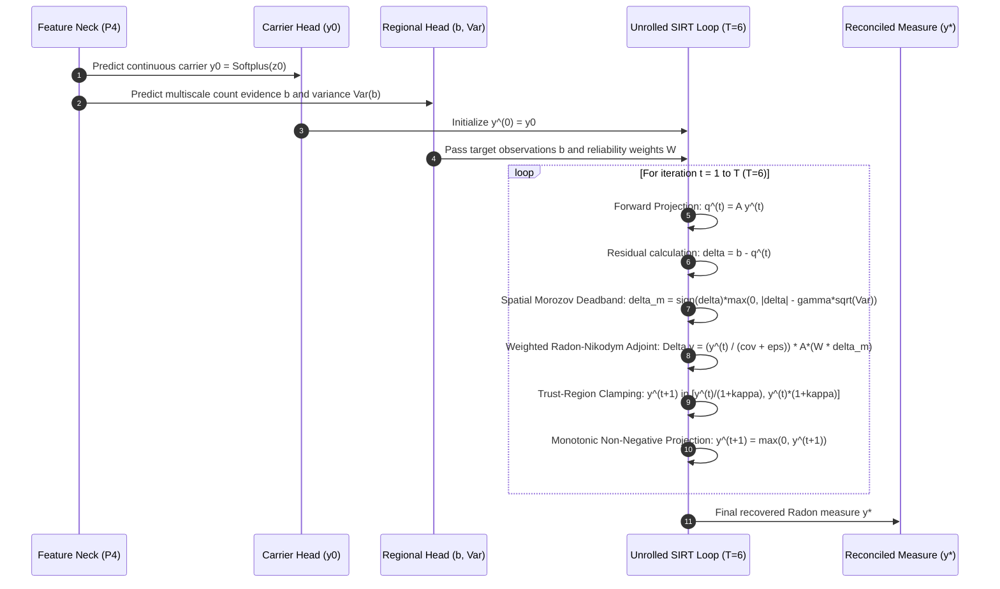

# Chapter 2: Unrolled Inverse Solver & Mathematical Foundations

This document details the mathematical formulation, algorithmic structure, and physical justification of the **Unrolled SIRT Inverse Solver** in RMR-v3 ([`rmr_v3/solver.py`](file:///f:/lightweightcrcn/rmr_v3/solver.py) and [`rmr_v3/model/solver_step.py`](file:///f:/lightweightcrcn/rmr_v3/model/solver_step.py)).

---

## 1. Problem Formulation: Fredholm Integral Equation

In conventional crowd counting, neural networks directly regress a high-resolution density map. When crowd density reaches extreme levels ($> 1,500$ people in an image), individual heads span fewer than $3\text{--}4\text{ px}$, causing point-supervision gradients to clash.

RMR-v3 reformulates crowd counting as an **Ill-Posed Linear Inverse Problem**:
$$b = \mathcal{A} y + \eta$$

where:
1. $y \in L^1_+(\Omega)$: The non-negative spatial crowd distribution (Radon measure) over image lattice $\Omega$.
2. $\mathcal{A}: L^1_+(\Omega) \to \mathbb{R}^M$: The multiscale forward observation operator integrating measure $y$ over $M$ overlapping spatial regions $\mathcal{B}_m = [x_m, y_m, w_m, h_m] \in \{32, 64, 128\}\text{ px}$:
   $$(\mathcal{A} y)_m = \int_{\mathcal{B}_m} y(u, v) \, du \, dv = \sum_{(u, v) \in \mathcal{B}_m} y_{u, v}$$
3. $b \in \mathbb{R}^M$: Regional count observations predicted by the Probabilistic Regional Evidence Head.
4. $\eta \sim \mathcal{N}(0, \Sigma_b)$: Observation noise characterized by Negative-Binomial dispersion:
   $$\text{Var}(b_m) = \mu_m + \alpha_m \mu_m^2$$

---

## 2. Iterative Unrolled Solver Architecture

To invert $\mathcal{A}$ without parameter explosion, RMR-v3 unrolls $T=6$ iterations of the **Simultaneous Iterative Reconstruction Technique (SIRT)** into a differentiable computational graph:

---

## 3. Mathematical Foundations of Solver Operators

### 3.1. Forward Operator $\mathcal{A}$ ([`rmr_core/operators.py`](file:///f:/lightweightcrcn/rmr_core/operators.py))
For each region $\mathcal{B}_m$, the integral is computed via 2D prefix sums (integral images) or vectorized regional gathering:
$$(\mathcal{A} y)_m = \sum_{r = y_m}^{y_m + h_m - 1} \sum_{c = x_m}^{x_m + w_m - 1} y_{r, c}$$

### 3.2. Radon-Nikodym Adjoint Operator $\mathcal{A}^*$
Standard Landweber backprojection uses the flat adjoint:
$$\Delta y_{\text{flat}} = \mathcal{A}^* (b - \mathcal{A} y)$$
**Critical Pitfall of Flat Adjoint:**
$\mathcal{A}^*$ broadcasts regional residuals uniformly across the entire box $\mathcal{B}_m$. In an image with $10$ heads standing in the top-left corner of a $128\text{ px}$ box and empty background in the remaining $90\%$ of the box, flat backprojection dumps mass into empty background pixels, creating massive false-positive noise.

**The Radon-Nikodym Solution:**
RMR-v3 computes the update modulated by the Radon-Nikodym derivative with respect to current measure $y$:
$$\Delta y = \frac{y}{\mathcal{C}_w + \epsilon} \odot \mathcal{A}^*\left(W \odot \delta_{\text{morozov}}\right)$$
where $\mathcal{C}_w = \mathcal{A}^*(W \odot \mathbf{1})$ is the spatially weighted coverage density.

* **Mass-Sparing Property:** Where $y(u, v) \approx 0$ (background), $\Delta y \approx 0$. Residual mass is strictly steered to locations where neural features already detect crowd presence.

---

### 3.3. Zero-Support Trap & Mathematical Remedy

#### The Failure Mechanism
If carrier $y_0(u, v) \to 0$ in an extremely dense, dark cluster due to softplus logit ceiling ($z_0 \le -6.0$), the multiplicative update locks up:
$$\Delta y(u, v) = 0 \cdot \delta = 0$$
The solver becomes permanently blind to that cluster, regardless of how strong the regional evidence $b$ is.

#### The Remedy in RMR-v3
1. **Calibrated Baseline Floor:** Carrier Softplus incorporates a non-negative floor parameter $\tau_{\text{floor}}$:
   $$y_{\text{eff}} = \max\left(y_0, \tau_{\text{floor}} \cdot \mathbf{1}_{\Omega}\right)$$
2. **Symmetric Carrier Alignment:** When evaluating both forward projection and backward adjoint, the effective measure is preserved uniformly across computation steps.

---

### 3.4. Spatial Morozov Discrepancy Principle

In classical inverse problems, continuing iterations until residual $\|b - \mathcal{A} y\| \to 0$ overfits observational noise $\eta$.
The **Morozov Discrepancy Principle** asserts that the residual should not be forced below the noise level of the data:
$$\|\delta_m\| \le \gamma \cdot \sigma_m$$

In RMR-v3, the residual is passed through a **noise-aware deadband filter**:
$$\delta_{\text{morozov}, m} = \begin{cases}
0, & \text{if } |\delta_m| \le \gamma \sqrt{\text{Var}(b_m)} \\
\delta_m - \gamma \sqrt{\text{Var}(b_m)}, & \text{if } \delta_m > \gamma \sqrt{\text{Var}(b_m)} \\
\delta_m + \gamma \sqrt{\text{Var}(b_m)}, & \text{if } \delta_m < -\gamma \sqrt{\text{Var}(b_m)}
\end{cases}$$

* In regions where headcount estimation uncertainty is high (large $\alpha_m$), the solver acts conservatively.
* In clean, high-confidence regions ($\text{Var}(b_m) \to 0$), the solver applies full corrective force.

---

### 3.5. Contraction Mapping & Energy Dissipation

The regional objective function minimized by SIRT is the weighted discrepancy:
$$\mathcal{E}(y) = \frac{1}{2} \sum_{m=1}^M W_m \left((\mathcal{A} y)_m - b_m\right)^2$$
To guarantee that $y^{(t+1)}$ does not oscillate or diverge, the step size $\omega$ is bounded by the operator norm:
$$\omega < \frac{2}{\|\mathcal{A}^* \mathcal{A}\|_2}$$
Furthermore, a **Trust-Region Multiplicative Bound** $\kappa = 0.35$ limits the maximum per-step relative change:
$$\frac{y^{(t)}}{1 + \kappa} \le y^{(t+1)} \le y^{(t)} \cdot (1 + \kappa)$$
This prevents extreme step-to-step spikes and guarantees monotonic energy dissipation $\mathcal{E}(y^{(t+1)}) \le \mathcal{E}(y^{(t)})$.

---

## 4. Parameter & Computational Efficiency

* **Trainable Parameters:** Exactly **0 parameters** ($0.0\%$). The entire solver is governed by deterministic physical and mathematical operators ($\mathcal{A}$, $\mathcal{A}^*$, soft thresholding).
* **Autograd Graph:** Gradients backpropagate directly through the unrolled loop into the backbone and regional heads via standard PyTorch reverse-mode AD.
