# Chapter 3: Loss Functions & High-Efficiency Point Supervision

This document explains the mathematical loss formulations, modular loss architecture across 13 specialized files, gradient coordination dynamics, and the memory-saving custom autograd implementation in [`rmr_v3/losses/`](file:///f:/lightweightcrcn/rmr_v3/losses/).

---

## 1. Modular Loss Architecture Overview

To eliminate monolithic files and enforce single responsibility, loss computation is decoupled into specialized modules coordinated by [`rmr_v3/losses/orchestration.py`](file:///f:/lightweightcrcn/rmr_v3/losses/orchestration.py):

```mermaid
flowchart TD
    ORCH["compute_rmr_v3_losses (orchestration.py)"]

    subgraph MacroCount ["Macro & Global Count Losses"]
        CNT["Count Magnitude Loss (L1, NB NLL, Huber)<br/>rmr_core/losses.py"]
        ORCH --> CNT
    end

    subgraph SpatialAlloc ["Spatial Point Allocation"]
        ALLOC["route_allocation_loss (allocation.py)"]
        BAYES["Memory-Efficient Bayesian Loss (point_supervision.py)"]
        DM16["Flat-DM16 Dirichlet-Multinomial (rmr_core/losses.py)"]
        FIDT["Canonical FIDTM Loss (fidt.py)"]
        CHFL["Canonical ChfL Fourier Loss (chfl.py)"]
        OT["Sinkhorn Optimal Transport (point_supervision.py)"]
        ORCH --> ALLOC
        ALLOC --> BAYES & DM16 & FIDT & CHFL & OT
    end

    subgraph CellStream ["Cell-Level Supervisions"]
        CELL["compute_cell_loss (cell.py)"]
        CI_CELL["Count-Invariant CI-Cell v2"]
        HARM["Count-Harmonized Cell Loss"]
        MASS["Mass-Weighted Smooth L1"]
        ORCH --> CELL
        CELL --> CI_CELL & HARM & MASS
    end

    subgraph RegionalEvidence ["Regional Evidence Losses"]
        REG["scale_balanced_regional_nb_nll (regional.py)"]
        HURD["hurdle_focal_bce_loss (regional.py)"]
        TRUNC["truncated_nb_nll_loss (regional.py)"]
        ORCH --> REG & HURD & TRUNC
    end

    subgraph GeometricPriors ["Geometric & Spatial Priors"]
        CURV["curvature_power_loss (spatial_priors.py)"]
        ALIGN["physical_scale_alignment_loss (spatial_priors.py)"]
        TOPK["topk_hard_background_loss (spatial_priors.py)"]
        ORCH --> CURV & ALIGN & TOPK
    end
```

---

## 2. Point Supervision Formulations

Point annotations provide discrete pixel locations $\{z_n\}_{n=1}^N \subset \mathbb{R}^2$ rather than bounding boxes. Converting these into dense supervision without subjective Gaussian blurring is critical.

### 2.1. Canonical Bayesian Loss (Ma et al. ICCV 2019) ([`rmr_v3/losses/point_supervision.py`](file:///f:/lightweightcrcn/rmr_v3/losses/point_supervision.py))
Bayesian Loss treats crowd counting as estimating posterior expectations over spatial allocations.
For pixel $x_m \in \Omega$ and ground truth point $z_n$:
$$P(z_n | x_m) = \frac{1}{\mathcal{Z}(x_m)} \exp\left(-\frac{\|x_m - z_n\|_2^2}{2\sigma_n^2}\right)$$
$$P(z_0 | x_m) = \frac{1}{\mathcal{Z}(x_m)} \tau_{\text{bg}}$$
where $z_0$ represents the virtual background class, and $\mathcal{Z}(x_m) = \tau_{\text{bg}} + \sum_{n=1}^N \exp\left(-\frac{\|x_m - z_n\|_2^2}{2\sigma_n^2}\right)$ ensures partition of unity.

The expected headcount attributed to person $n$ by model density field $y$ is:
$$\hat{c}_n = \sum_{m \in \Omega} P(z_n | x_m) \cdot y(x_m) = \sum_{m \in \Omega} K_{n, m} \cdot u_m$$
where $u_m = y(x_m) / \mathcal{Z}(x_m)$ and $K_{n, m} = \exp(-\|x_m - z_n\|^2 / (2\sigma_n^2))$.

The total Bayesian supervision loss is:
$$\mathcal{L}_{\text{Bayesian}} = \sum_{n=1}^N |\hat{c}_n - 1.0| + \hat{c}_0$$
where $\hat{c}_0 = \sum_{m \in \Omega} P(z_0 | x_m) y(x_m)$ penalizes false positive density placed in empty background.

---

### 2.2. Memory Bottleneck & Custom Autograd Engine

#### The $\mathcal{O}(B \cdot N \cdot M)$ Autograd Memory Crisis
At Stride 2 ($256 \times 256$), the number of spatial pixels is $M = 65,536$. In dense images with $N = 2,500$ people:
* Distance matrix $D \in \mathbb{R}^{N \times M}$ contains $2,500 \times 65,536 = 163.84 \times 10^6$ elements ($655.4\text{ MB}$ in `float32`).
* Standard PyTorch autograd records all intermediate tensors (`dx`, `dy`, `d2`, `k_chunk`) into the reverse computational graph.
* Across batch size $B=4\text{--}8$, autograd graph retention demanded **$3,570\text{ MB}$ to $3,936\text{ MB}$ of VRAM**, causing out-of-memory errors on consumer GPUs.

#### Analytical Backward Recomputation
The gradient of the person error $\mathcal{L}_{\text{person}} = \sum_{n=1}^N |\hat{c}_n - 1|$ with respect to normalized pixel intensity $u_m$ has the closed-form analytical expression:
$$\frac{\partial \mathcal{L}_{\text{person}}}{\partial u_m} = \sum_{n=1}^N \text{sign}(\hat{c}_n - 1) \cdot K_{n, m}$$

Because this gradient depends *only* on $K_{n, m}$ and the scalar error sign $s_n = \text{sign}(\hat{c}_n - 1)$, [`_BayesianPersonErrorFunction`](file:///f:/lightweightcrcn/rmr_v3/losses/point_supervision.py#L10) implements a custom PyTorch autograd operator:
1. **Forward:** Computes $\hat{c}_n$ using memory-bounded chunks (`chunk_size = 64`). Discards all intermediate matrices immediately. Saves *only* point coordinates and signs $s_n \in \{-1, +1\}^N$ ($< 50\text{ KB}$).
2. **Backward:** Recomputes $K_{n, m}$ chunk-by-chunk and accumulates $\nabla_u \mathcal{L}$ directly into GPU registers using in-place matrix-vector products (`grad_u.addmv_(k_chunk.t(), s_chunk)`).
3. **VRAM Impact:** Peak reserved VRAM drops from **$3,570.0\text{ MB}$ to $960.0\text{ MB}$** (**$-73.1\%$ reduction**).
4. **Numerical Parity:** Exact mathematical identity ($0.00e+00$ loss discrepancy, max gradient difference $2.98 \times 10^{-7}$).

---

### 2.3. Density-Adaptive $k$-NN Gaussian Sharpness ($\sigma_n$)

In ultra-dense clusters ($N > 1,000$), heads are separated by $3\text{--}4\text{ px}$. A fixed Gaussian kernel $\sigma = 8.0$ creates an $88\%$ overlap between neighboring heads, washing out spatial gradients.

When `adaptive_sigma: true`, RMR-v3 computes per-head adaptive variance based on $k$-nearest neighbors:
$$d_{\text{knn}}(n) = \text{dist}\left(z_n, \text{4-th NN}\right)$$
$$\sigma_n = \text{clamp}\left(0.5 \cdot d_{\text{knn}}(n), \, \sigma_{\min}, \, \sigma_{\max}\right) \quad (\sigma_{\min}=2.0, \sigma_{\max}=8.0)$$
In dense clusters, $\sigma_n$ automatically contracts to $2.0\text{ px}$, maintaining sharp local peaks; in sparse clusters, it expands up to $8.0\text{ px}$ to provide broad basins of attraction.

---

## 3. Advanced Continuous Allocation Formulations

### 3.1. Canonical FIDT Loss (Liang et al. TPAMI 2022) ([`rmr_v3/losses/fidt.py`](file:///f:/lightweightcrcn/rmr_v3/losses/fidt.py))
Focal Inverse Distance Transform constructs an inverse distance representation:
$$I(p) = \frac{1}{1 + d(p)^{0.02 \cdot d(p) + 0.75}}$$
where $d(p)$ is the Euclidean distance from pixel $p$ to the nearest head.
* At every head location: $d(p) = 0 \implies I(p) = 1.0$ unconditionally.
* No density saturation occurs because heads do not additively blend together.
* Supervised via balanced Smooth L1 loss across foreground ($I > 0.05$) and background pixels.

### 3.2. Canonical Characteristic Function Loss (Shu et al. CVPR 2022) ([`rmr_v3/losses/chfl.py`](file:///f:/lightweightcrcn/rmr_v3/losses/chfl.py))
Measures the crowd distribution in the continuous spatial frequency domain:
$$\Phi_{\text{gt}}(\mathbf{t}) = \sum_{j=1}^N \exp\left(i \mathbf{t}^T z_j\right) \cdot \exp\left(-\frac{1}{2} \|\mathbf{t}\|_2^2 \sigma_{\text{bw}}^2\right)$$
$$\Phi_{\text{pred}}(\mathbf{t}) = \sum_{u \in \Omega} y_{\text{pred}}(u) \cdot \exp\left(i \mathbf{t}^T u\right)$$
At zero frequency $\mathbf{t} = 0$: $\Phi_{\text{gt}}(0) = N$ and $\Phi_{\text{pred}}(0) = \sum y$, strictly enforcing global mass conservation across all spatial frequencies.

---

## 4. Probabilistic Regional Evidence Supervision ([`rmr_v3/losses/regional.py`](file:///f:/lightweightcrcn/rmr_v3/losses/regional.py))

Regional evidence head parameters $(\mu_m, \alpha_m)$ are trained using Negative-Binomial Negative Log-Likelihood:
$$\mathcal{L}_{\text{NB}}(b_m, \mu_m, \alpha_m) = -\ln \Gamma\left(b_m + \frac{1}{\alpha_m}\right) + \ln \Gamma\left(\frac{1}{\alpha_m}\right) + \ln \Gamma(b_m + 1) - \frac{1}{\alpha_m} \ln\left(1 + \alpha_m \mu_m\right) - b_m \ln\left(\frac{\alpha_m \mu_m}{1 + \alpha_m \mu_m}\right)$$

### Scale-Balanced Normalization
Regional loss is normalized per scale:
$$\mathcal{L}_{\text{region\_nb}} = \frac{1}{K} \sum_{k=1}^K \frac{1}{M_k} \sum_{m \in \mathcal{S}_k} \mathcal{L}_{\text{NB}}(b_m, \mu_m, \alpha_m)$$
This prevents $32\text{ px}$ boxes ($M_{32} = 1,024$) from drowning out $128\text{ px}$ boxes ($M_{128} = 64$) by a factor of $16\times$.
