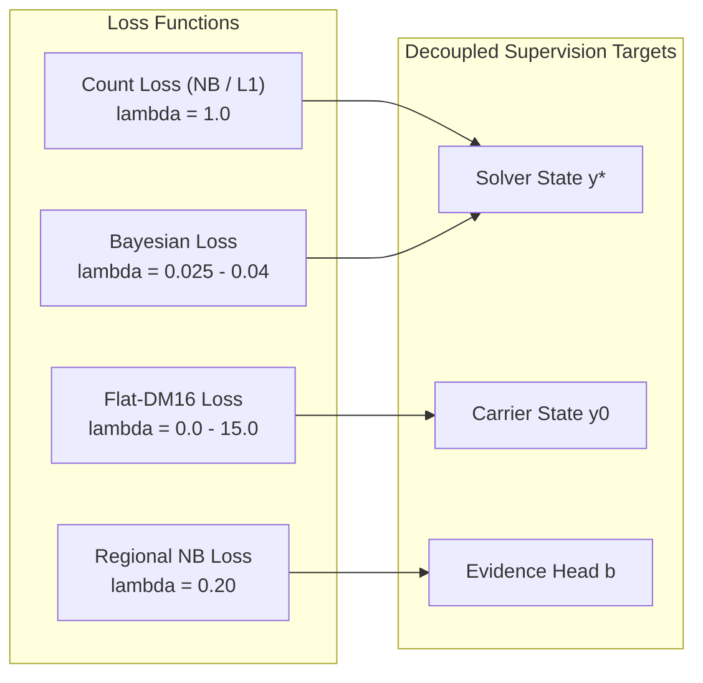

# Chapter 3: Loss Functions & High-Efficiency Point Supervision

This document explains the mathematical loss formulations, gradient coordination dynamics, and the memory-saving custom autograd implementation in [`rmr_v3/losses/point_supervision.py`](file:///f:/lightweightcrcn/rmr_v3/losses/point_supervision.py) and [`rmr_v3/losses/orchestration.py`](file:///f:/lightweightcrcn/rmr_v3/losses/orchestration.py).

---

## 1. Point Supervision Formulation

Point annotations provide discrete pixel locations $\{z_n\}_{n=1}^N \subset \mathbb{R}^2$ rather than bounding boxes. Converting these into dense supervision without subjective Gaussian blurring is critical.

### 1.1. Canonical Bayesian Loss (Ma et al. ICCV 2019)
Bayesian Loss treats crowd counting as estimating posterior expectations over spatial allocations.
For pixel $x_m \in \Omega$ and ground truth point $z_n$:
$$P(z_n | x_m) = \frac{1}{\mathcal{Z}(x_m)} \exp\left(-\frac{\|x_m - z_n\|_2^2}{2\sigma_n^2}\right)$$
$$P(z_0 | x_m) = \frac{1}{\mathcal{Z}(x_m)} \tau_{\text{bg}}$$
where $z_0$ represents the virtual background class, and $\mathcal{Z}(x_m) = \tau_{\text{bg}} + \sum_{n=1}^N \exp\left(-\frac{\|x_m - z_n\|_2^2}{2\sigma_n^2}\right)$ ensures partition of unity.

The expected headcount attributed to person $n$ by model density field $y$ is:
$$\hat{c}_n = \sum_{m \in \Omega} P(z_n | x_m) \cdot y(x_m) = \sum_{m \in \Omega} K_{n, m} \cdot u_m$$
where $u_m = y(x_m) / \mathcal{Z}(x_m)$ and $K_{n, m} = \exp(-\|x_m - z_n\|^2 / (2\sigma_n^2))$.

The total Bayesian supervision loss is:
$$\mathcal{L}_{\text{Bayesian}} = \sum_{n=1}^N |\hat{c}_n - 1.0| + \hat{c}_0$$
where $\hat{c}_0 = \sum_{m \in \Omega} P(z_0 | x_m) y(x_m)$ penalizes false positive density placed in empty background.

---

## 2. Memory Bottleneck & Custom Autograd Engine

### 2.1. The $\mathcal{O}(B \cdot N \cdot M)$ Autograd Memory Crisis
At Stride 2 ($256 \times 256$), the number of spatial pixels is $M = 65,536$. In dense images with $N = 2,500$ people:
* Distance matrix $D \in \mathbb{R}^{N \times M}$ contains $2,500 \times 65,536 = 163.84 \times 10^6$ elements ($655.4\text{ MB}$ in `float32`).
* Standard PyTorch autograd records all intermediate tensors (`dx`, `dy`, `d2`, `k_chunk`) into the reverse computational graph.
* Across batch size $B=4\text{--}8$, autograd graph retention demanded **$3,570\text{ MB}$ to $3,936\text{ MB}$ of VRAM**, causing out-of-memory errors on consumer GPUs.


---

### 2.2. Mathematical Solution: Analytical Backward Recomputation

The gradient of the person error $\mathcal{L}_{\text{person}} = \sum_{n=1}^N |\hat{c}_n - 1|$ with respect to normalized pixel intensity $u_m$ has the closed-form analytical expression:
$$\frac{\partial \mathcal{L}_{\text{person}}}{\partial u_m} = \sum_{n=1}^N \text{sign}(\hat{c}_n - 1) \cdot K_{n, m}$$

Because this gradient depends *only* on $K_{n, m}$ and the scalar error sign $s_n = \text{sign}(\hat{c}_n - 1)$, [`_BayesianPersonErrorFunction`](file:///f:/lightweightcrcn/rmr_v3/losses/point_supervision.py#L9) implements a custom PyTorch autograd operator:
1. **Forward:** Computes $\hat{c}_n$ using memory-bounded chunks (`chunk_size = 64`). Discards all intermediate matrices immediately. Saves *only* point coordinates and signs $s_n \in \{-1, +1\}^N$ ($< 50\text{ KB}$).
2. **Backward:** Recomputes $K_{n, m}$ chunk-by-chunk and accumulates $\nabla_u \mathcal{L}$ directly into GPU registers:
   ```python
   for c in range(0, n, chunk_size):
       p = pts[c : c + chunk_size]
       dx = p[:, 0:1] - gx
       dy = p[:, 1:2] - gy
       d2 = dx.square_().add_(dy.square_())
       k_chunk = torch.exp(d2.mul_(-ik))
       # Direct analytical accumulation without graph retention
       grad_u += torch.matmul(k_chunk.t(), sign[c : c + chunk_size])
   ```

* **VRAM Impact:** Peak reserved VRAM drops from **$3,570.0\text{ MB}$ to $960.0\text{ MB}$** (**$-73.1\%$ reduction**).
* **Parity:** Exact mathematical identity ($0.00e+00$ loss discrepancy, max grad difference $2.98 \times 10^{-7}$).

---

### 2.3. Density-Adaptive $k$-NN Sharpness ($\sigma_n$)

Fixed Gaussian radii ($\sigma = 8.0$) cause $88\%$ kernel overlap between heads closer than $4\text{ px}$, washing out high-frequency gradients.
RMR-v3 computes adaptive sharpness based on 4-nearest-neighbor distance:
$$\sigma_n = \text{clamp}\left(\beta \cdot \bar{d}_{4\text{-NN}}(z_n), \, \sigma_{\min}, \, \sigma_{\max}\right)$$
* For Stride 2: $\sigma_{\min} = 1.5\text{ px}$, $\sigma_{\max} = 3.5\text{ px}$, $\beta = 0.5$.
* In congested clusters, $\sigma_n$ contracts to $1.5\text{ px}$, cleanly separating heads separated by only $2\text{--}3\text{ px}$.

---

## 3. Flat-DM16 Dirichlet-Multinomial Loss

Complementing micro-scale point assignment, macro-scale spatial allocation is supervised via Dirichlet-Multinomial distribution over $16 \times 16\text{ px}$ blocks (Wang et al. NeurIPS 2020):
$$\mathcal{L}_{\text{DM}} = \text{DM-Loss}(Y_{\text{pred}}, Y_{\text{GT}}, \kappa = 20.0)$$

### Head-Balanced Normalization Mode
Standard DM loss normalizes by sample headcount $N$, inducing $\mathcal{O}(1/N)$ gradient starvation on dense images ($N > 2,000$).
The `head_balanced` mode scales loss proportionally to cluster counts:
$$\mathcal{L}_{\text{DM}}^{\text{balanced}} = \frac{1}{\sqrt{N + 1}} \mathcal{L}_{\text{DM}}$$
balancing gradient norms across both sparse ($N=30$) and ultra-dense ($N=2,500$) scenes.

---

## 4. Multi-Task Loss Orchestration & Decoupling

The full optimization objective combines four complementary loss components:
$$\mathcal{L}_{\text{total}} = \lambda_{\text{count}} \mathcal{L}_{\text{count}} + \lambda_{\text{Bayes}} \mathcal{L}_{\text{Bayes}} + \lambda_{\text{DM}} \mathcal{L}_{\text{DM}} + \lambda_{\text{reg}} \mathcal{L}_{\text{reg}}$$



* **Decoupled Supervision:** Micro point supervision ($\mathcal{L}_{\text{Bayes}}$) guides the final high-resolution measure $y^*$, while macro allocation ($\mathcal{L}_{\text{DM}}$) guides the coarse carrier $y_0$. This prevents gradient cancellation between the initial carrier and the unrolled solver.
