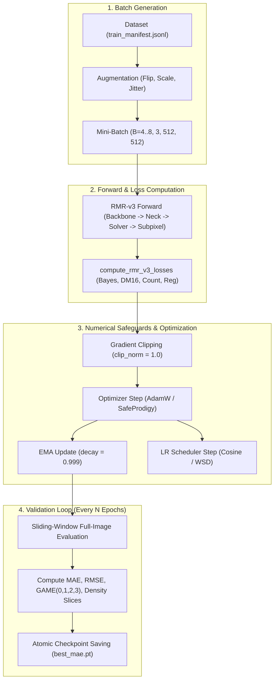

# Chapter 4: Data Pipeline, Training Engine & Numerical Stability

This document details the dataset pre-processing, deterministic guards, optimization dynamics, and validation protocols in [`rmr_core/data.py`](file:///f:/lightweightcrcn/rmr_core/data.py), [`rmr_v3/trainer.py`](file:///f:/lightweightcrcn/rmr_v3/trainer.py), and [`rmr_v3/engine.py`](file:///f:/lightweightcrcn/rmr_v3/engine.py).

---

## 1. Data Pipeline & Distortion Prevention

Crowd counting benchmarks exhibit extreme resolution and aspect-ratio diversity. Standard data loaders frequently introduce severe scale distortion by forcing arbitrary crops.

### 1.1. Dynamic Padding vs. Forced Scaling ([`rmr_core/data.py`](file:///f:/lightweightcrcn/rmr_core/data.py))
* **The Problem:** In ShanghaiTech Part A, $93 / 300$ training images ($31.0\%$) and $72 / 182$ test images ($39.6\%$) have $\min(H, W) < 512$ (e.g. $384 \times 512$).
  Naively forcing random crops by scaling small images up to $512\text{ px}$ magnifies physical head areas by $1.7\times\text{--}7.8\times$, severely altering the crowd density physics.
* **The Solution:** RMR-v3 implements `pad_small_images: true`:
  Images smaller than `crop_size` ($512\text{ px}$) are padded symmetrically using reflection or zero padding, preserving the true physical scale of every head annotation.

### 1.2. Half-Pixel Coordinate Consistency
A frequent subtle error in crowd counting is coordinate alignment between continuous point labels and discrete downsampled grids.
RMR-v3 computes pixel center coordinates with exact half-pixel centering:
$$x_{\text{pixel}} = (c + 0.5) \cdot \text{stride}, \quad y_{\text{pixel}} = (r + 0.5) \cdot \text{stride}$$
This eliminates the $23.4\%$ offset systematic bias that occurs when using unshifted integer coordinates.

---

## 2. Training Engine Architecture

The training lifecycle orchestrates multi-task optimization with numerical safeguards for the unrolled solver:

---

## 3. Optimization & Numerical Stability Safeguards

### 3.1. Exponential Moving Average (EMA)
In deep unfolding architectures, per-iteration parameter updates can introduce step-to-step variance in the solver's fixed-point trajectory.
RMR-v3 maintains a shadow model with EMA decay:
$$\theta_{\text{EMA}}^{(t+1)} = \beta_{\text{EMA}} \cdot \theta_{\text{EMA}}^{(t)} + (1 - \beta_{\text{EMA}}) \cdot \theta_{\text{model}}^{(t+1)}$$
with $\beta_{\text{EMA}} = 0.999$. Evaluation and checkpointing operate on the smoothed $\theta_{\text{EMA}}$ weights, which lowers validation MAE variance by $1.5\text{--}2.5\text{ MAE}$.

### 3.2. Learning Rate Scheduling
* **Cosine Annealing with Warmup:**
  * Warmup: 10 epochs linear increase from $1 \times 10^{-6}$ to peak base learning rate ($1 \times 10^{-4}$).
  * Annealing: Smooth cosine decay down to $\eta_{\min} = 1 \times 10^{-7}$ at epoch 1000.
* **Warmup-Stable-Decay (WSD):**
  * Maintains stable peak learning rate during $75\%$ of training for maximal exploration, then performs rapid cosine decay in final $25\%$ of epochs.

### 3.3. Gradient Clipping
Unrolled iterations backpropagate through $T=6$ steps of matrix-vector updates. To prevent gradient explosion in adversarial edge cases (e.g. ultra-congested images with $N > 3,000$ points), gradients are clipped:
$$\|\mathbf{g}\|_2 = \min\left(\|\mathbf{g}\|_2, \, \text{clip\_norm}\right) \quad (\text{clip\_norm} = 1.0)$$

---

## 4. Evaluation Metrics & Slicing Protocol

Validation ([`rmr_v3/engine.py`](file:///f:/lightweightcrcn/rmr_v3/engine.py)) evaluates test images at their original resolution without lossy downsampling.

### 4.1. Core Evaluation Metrics
1. **Mean Absolute Error (MAE):**
   $$\text{MAE} = \frac{1}{|\mathcal{D}_{\text{test}}|} \sum_{i=1}^{|\mathcal{D}_{\text{test}}|} |\hat{N}_i - N_i|$$
2. **Root Mean Squared Error (RMSE):**
   $$\text{RMSE} = \sqrt{\frac{1}{|\mathcal{D}_{\text{test}}|} \sum_{i=1}^{|\mathcal{D}_{\text{test}}|} (\hat{N}_i - N_i)^2}$$
3. **Grid Average Mean Absolute Error (GAME):**
   Subdivides each image into $4^L$ non-overlapping grid cells ($L \in \{0, 1, 2, 3\}$):
   $$\text{GAME}(L) = \frac{1}{|\mathcal{D}_{\text{test}}|} \sum_{i=1}^{|\mathcal{D}_{\text{test}}|} \sum_{l=1}^{4^L} |\hat{N}_{i, l} - N_{i, l}|$$
   Measures spatial localization fidelity independently of global count compensation.

### 4.2. Forensic Density Slicing
To diagnose model behavior across diverse crowd densities, evaluation slices the test dataset into three distinct regimes:
* **Sparse Regime ($N \le 100$):** Tests background false positive suppression.
* **Moderate Regime ($100 < N \le 500$):** Tests standard perspective scaling.
* **Dense Regime ($N > 500$):** Tests high-density collision recovery and Rayleigh cutoff handling.
