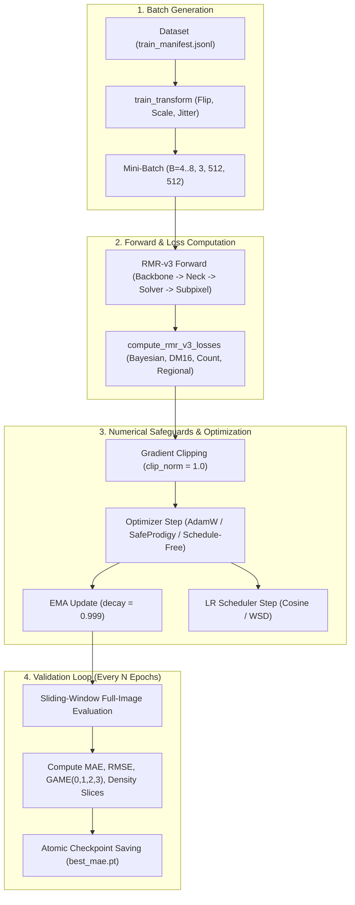

# Chapter 4: Data Pipeline, Training Engine & Numerical Stability

This document details the dataset pre-processing, deterministic guards, optimization dynamics, and validation protocols in [`rmr_core/data.py`](file:///f:/lightweightcrcn/rmr_core/data.py), [`rmr_v3/trainer.py`](file:///f:/lightweightcrcn/rmr_v3/trainer.py), [`rmr_v3/engine.py`](file:///f:/lightweightcrcn/rmr_v3/engine.py), and [`rmr_v3/optim/`](file:///f:/lightweightcrcn/rmr_v3/optim/).

---

## 1. Data Pipeline & Distortion Prevention ([`rmr_core/data.py`](file:///f:/lightweightcrcn/rmr_core/data.py))

Crowd counting benchmarks exhibit extreme resolution and aspect-ratio diversity. Standard data loaders frequently introduce severe scale distortion by forcing arbitrary crops.

### 1.1. Dynamic Padding vs. Forced Scaling
* **The Problem:** In ShanghaiTech Part A, $93 / 300$ training images ($31.0\%$) and $72 / 182$ test images ($39.6\%$) have $\min(H, W) < 512$ (e.g. $384 \times 512$).
  Naively forcing random crops by scaling small images up to $512\text{ px}$ magnifies physical head areas by $1.7\times\text{--}7.8\times$, severely altering crowd density physics.
* **The Solution:** RMR-v3 implements `pad_small_images: true`:
  Images smaller than `crop_size` ($512\text{ px}$) are padded symmetrically using reflection or zero padding, preserving the true physical scale of every head annotation.

### 1.2. Exact Half-Pixel Continuous Coordinate Scaling
A frequent subtle error in crowd counting pipelines is coordinate misalignment between continuous point labels and discrete downsampled grids.
When resizing an image from $(W_0, H_0)$ to $(W_1, H_1)$, RMR-v3 applies continuous half-pixel centering:
$$x' = (x + 0.5) \cdot \frac{W_1}{W_0} - 0.5, \quad y' = (y + 0.5) \cdot \frac{H_1}{H_0} - 0.5$$
Similarly, rasterizing points to stride cells ([`rasterize_points`](file:///f:/lightweightcrcn/rmr_core/data.py#L15)) maps:
$$i = \left\lfloor \frac{y}{\text{stride}} \right\rfloor, \quad j = \left\lfloor \frac{x}{\text{stride}} \right\rfloor$$
Points outside image support are ignored rather than clipped into boundary cells, preventing false border accumulation.

---

## 2. Advanced Optimization Infrastructure ([`rmr_v3/optim/`](file:///f:/lightweightcrcn/rmr_v3/optim/))

### 2.1. SafeProdigy: Rate-Limited Distance Adaptation ([`rmr_v3/optim/safe_prodigy.py`](file:///f:/lightweightcrcn/rmr_v3/optim/safe_prodigy.py))
Standard Prodigy (Defazio & Mishchenko, NeurIPS 2023) automatically estimates distance to optimum $D = \|x_0 - x^*\|_2$.
However, in unrolled inverse architectures with iterative solvers, early exponential growth of $D_k$ can cause step spikes, triggering numeric divergence.

`SafeProdigy` introduces 4 stability guarantees:
1. **Linear D-Warmup:** Freezes distance adaptation during the first $N_{\text{warmup}}$ steps.
2. **Growth Rate Limiter:** Bounds the per-step expansion factor:
   $$\ln\left(\frac{D_{k+1}}{D_k}\right) \le \delta_{\max} \quad (\text{growth\_rate} \le 0.10)$$
3. **Ceiling Bound:** $D_k \le D_{\text{cap}}$ prevents unbounded learning rate inflation.
4. **Gradient Norm Gate:** Freezes $D$ if gradient norm $\|\mathbf{g}\|_2 > G_{\text{thresh}}$.

### 2.2. Schedule-Free AdamW ([`rmr_v3/optim/schedule_free.py`](file:///f:/lightweightcrcn/rmr_v3/optim/schedule_free.py))
Implements Meta FAIR's Schedule-Free optimization (Defazio et al. 2024):
* Replaces manual cosine schedules with iterate averaging:
  $$x_{k+1} = y_k - \gamma \nabla f(y_k)$$
  $$z_{k+1} = (1 - c_k) z_k + c_k x_{k+1}, \quad c_k = \frac{k+1}{2}$$
* Training evaluates gradients at exploration points $y_k$, while inference evaluates the smoothed iterate $z_k$.
* Requires no preset epoch budget, maintaining convergence whether training for 300 or 1,000 epochs.

### 2.3. Warmup-Stable-Decay (WSD) Scheduler ([`rmr_v3/optim/wsd_scheduler.py`](file:///f:/lightweightcrcn/rmr_v3/optim/wsd_scheduler.py))
* **Phase 1 (Warmup):** Linear warm-up across $5\text{--}10\%$ of steps.
* **Phase 2 (Stable):** Flat learning rate across $70\text{--}80\%$ of training for broad parameter exploration.
* **Phase 3 (Decay):** Rapid cosine annealing to zero across final $15\text{--}20\%$ of training for sharp basin convergence.

---

## 3. Training Engine Architecture ([`rmr_v3/trainer.py`](file:///f:/lightweightcrcn/rmr_v3/trainer.py))

---

## 4. Evaluation Engine & Slicing Protocols ([`rmr_v3/engine.py`](file:///f:/lightweightcrcn/rmr_v3/engine.py))

Validation processes test images at their original resolution without lossy downsampling.

### 4.1. Sliding-Window Tiled Evaluation ([`rmr_core/tiling.py`](file:///f:/lightweightcrcn/rmr_core/tiling.py))
For ultra-high-resolution images (e.g. $2048 \times 3072$ in UCF-QNRF / NWPU-Crowd):
* Divides image into overlapping $512 \times 512$ tiles with $50\%$ overlap.
* Applies a 2D Hann window weighting matrix to suppress tile-edge boundary artifacts:
  $$W_{\text{Hann}}(u, v) = \sin^2\left(\frac{\pi u}{H_{\text{tile}}}\right) \cdot \sin^2\left(\frac{\pi v}{W_{\text{tile}}}\right)$$
* Accumulates stitched predictions into an image-wide density canvas and normalizes by total tile weight.

### 4.2. Density-Sliced Evaluation Protocol
To isolate failure modes across crowd density regimes, validation partitions the test set into 3 slices:
1. **Sparse Slice ($N \le 100$):** Measures false positive suppression on background.
2. **Moderate Slice ($100 < N \le 500$):** Standard evaluation regime.
3. **Dense Slice ($N > 500$):** Measures density saturation resilience in extreme clusters.
