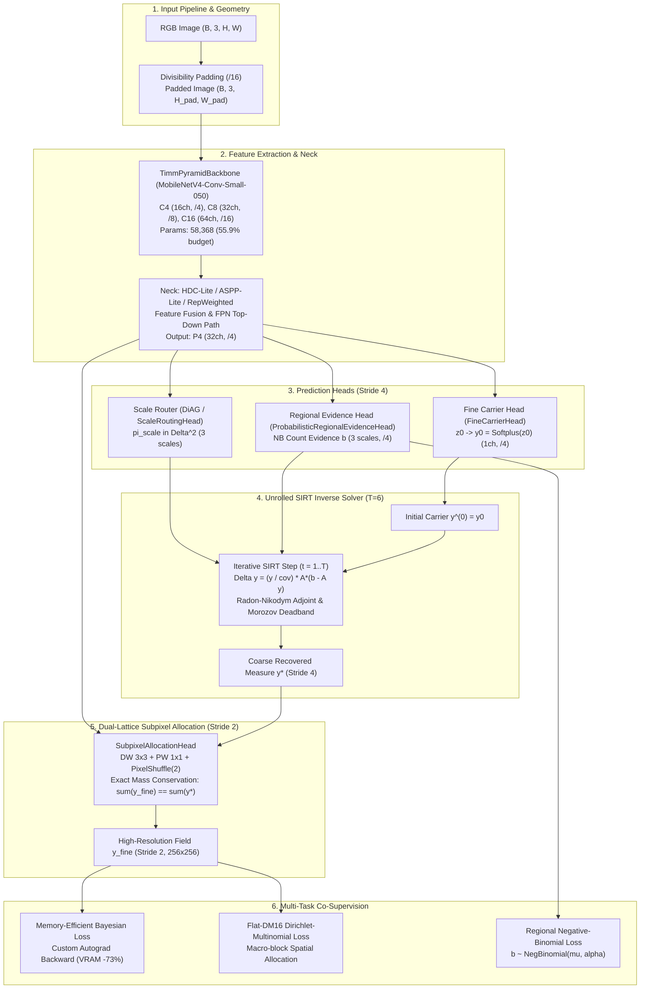

# RMR-v3 (Radon Measure Recovery) Codebase Explanation & Technical Guide

Welcome to the comprehensive code explanation documentation for **RMR-v3 (Reliability-Weighted Regional Measure Reconciliation)**. This documentation provides deep architectural breakdowns, mathematical foundations, optimization mechanisms, and implementation guides for researchers and developers.

---

## 1. System Overview & Core Scientific Paradigm

Standard crowd counting models formulate the objective as direct density map regression:
$$\mathcal{L}_{\text{MSE}} = \| \hat{D} - D_{\text{GT}} \|_2^2$$
However, at Stride 4 ($128 \times 128$ for $512 \times 512$ inputs), adjacent heads closer than $4\text{ px}$ merge into a single cell, causing severe **Density Saturation** and **Spatial Aliasing**.

**RMR-v3** reconceptualizes crowd counting as a **Fredholm Integral Equation of the First Kind**:
$$b = \mathcal{A} y + \eta$$
where:
* $y \in \mathcal{M}_+(\Omega)$ is the continuous underlying Radon density measure on image domain $\Omega$.
* $\mathcal{A}: \mathcal{M}_+(\Omega) \to \mathbb{R}^M$ is a multiscale box integration observation operator measuring regional headcount evidence over windows $\mathcal{B} \in \{32, 64, 128\}\text{ px}$.
* $b \in \mathbb{R}^M$ represents probabilistic regional count observations modeled via Negative-Binomial distributions:
  $$b_m \sim \text{NegBinomial}(\mu_m, \alpha_m), \quad \text{Var}(b_m) = \mu_m + \alpha_m \mu_m^2$$
* $\eta$ represents observational, perspective, and scale noise.

To recover $y$, RMR-v3 unrolls an **Unrolled SIRT (Simultaneous Iterative Reconstruction Technique) Solver** ($T=6$ iterations) governed by a **Radon-Nikodym Adjoint Operator** $\mathcal{A}^*$, paired with a **Dual-Lattice Subpixel Allocation Head** (Stride 2) that guarantees $100\%$ discrete mass conservation.

---

## 2. Global Architecture Flow



---

## 3. Directory Structure & Code Organization

The codebase strictly enforces clean code separation, modular factories, and file size ceilings ($\le 450$ lines per file, zero monolith violators):

```text
lightweightcrcn/
├── rmr_v3/                         # Primary RMR-v3 Research Package
│   ├── model/                      # Model definition & modular components
│   │   ├── architecture.py         # RMRv3: Core model wrapper, forward graph & region caching (298 lines)
│   │   ├── builder.py              # Modular factory builders for necks, routers, gates, heads (180 lines)
│   │   ├── config.py               # RMRv3Config schema & validate_architecture_contract (426 lines)
│   │   ├── canonical.py            # RMRv3Canonical: Research-grade neural network & solver loop
│   │   ├── dual_lattice.py         # SubpixelAllocationHead, push_forward_stride2_to_stride4
│   │   ├── evidence.py             # Probabilistic regional evidence extraction & hurdle gating
│   │   ├── perspective_geometry.py # DynamicCameraAnglePredictor (DiAG) & perspective routing
│   │   └── solver_step.py          # solve_inverse_measure & unrolled SIRT solver coordination
│   ├── losses/                     # Modular multi-task supervision
│   │   ├── orchestration.py        # compute_rmr_v3_losses: Multi-task loss coordinator
│   │   ├── point_supervision.py    # Memory-efficient Bayesian Loss with custom autograd backward
│   │   ├── allocation.py           # Spatial allocation routing (Bayesian, DM16, FIDT, OT)
│   │   ├── cell.py                 # Cell-level losses (CI-Cell v2, Harmonized, Mass-weighted)
│   │   ├── regional.py             # Regional Negative-Binomial NLL & hurdle focal BCE
│   │   ├── fidt.py                 # Official TPAMI 2022 Canonical FIDT loss
│   │   ├── chfl.py                 # Official CVPR 2022 Canonical Characteristic Function Loss
│   │   ├── dense_scaling.py        # Dynamic elementwise scaling for ultra-dense clusters
│   │   ├── dual_supervision.py     # Dual-lattice Stride 2 / Stride 4 supervision alignment
│   │   ├── spatial_priors.py       # Curvature power, physical scale alignment, top-k background
│   │   ├── router.py               # TargetSupervisionRouter dispatch
│   │   └── config.py               # RMRv3LossConfig schema
│   ├── optim/                      # Optimization & scheduling infrastructure
│   │   ├── safe_prodigy.py         # Rate-limited & ceiling-bounded SafeProdigy optimizer
│   │   ├── schedule_free.py        # Meta FAIR Schedule-Free AdamW wrapper
│   │   ├── wsd_scheduler.py        # Warmup-Stable-Decay learning rate scheduler
│   │   ├── lr_finder.py            # Leslie Smith LR range test
│   │   └── builder.py              # Optimizer & scheduler factory
│   ├── diagnostics/                # Model inspection, calibration & trajectory profiling
│   ├── engine.py                   # Evaluation loop, sliding window prediction & metric computation
│   ├── trainer.py                  # Training loop, early stopping, gradient clipping & EMA
│   └── train.py                    # Training CLI entry point
├── rmr_core/                       # Shared low-level primitives & dataset logic
│   ├── backbones.py                # TimmPyramidBackbone (MobileNetV4, MobileNetV3)
│   ├── necks/                      # FPN necks (HDC-Lite, ASPP-Lite, RepWeighted, Additive)
│   ├── heads.py                    # Fine carrier head & regional evidence heads
│   ├── operators/                  # Adjoint, forward pooling, Morozov deadband, prefix sums
│   ├── data.py                     # CrowdManifestDataset, continuous half-pixel transforms
│   ├── spectral.py                 # Fast Fourier transform crowd spectral analysis
│   ├── types.py                    # Core dataclasses: RegionSet, RMRModelOutput
│   ├── metrics.py                  # MAE, MSE, RMSE, GAME(0,1,2,3), density slices
│   └── evaluation.py               # Full-image evaluation & boundary stitching
├── tests/                          # Automated verification test suite (1,170+ tests)
│   ├── core/                       # Invariant & deep audit tests (test_systematic_deep_audit.py)
│   └── rmr_v3/                     # Bitwise parity, monolith prevention & ablation tests
└── docs/code_explanation/          # Systematic Technical Guides (Chapters 1 - 5)
```

---

## 4. Documentation Index

Detailed chapter-by-chapter walkthroughs:

1. **[01. Model Architecture & Forward Flow](file:///f:/lightweightcrcn/docs/code_explanation/01_model_architecture_and_forward_flow.md)**
   * MobileNetV4 UIB feature extraction, HDC-Lite vs ASPP-Lite multi-scale necks.
   * Modular builders ([`rmr_v3/model/builder.py`](file:///f:/lightweightcrcn/rmr_v3/model/builder.py)), contract validation ([`rmr_v3/model/config.py`](file:///f:/lightweightcrcn/rmr_v3/model/config.py)).
   * Dual-Lattice Subpixel Stride 2 allocation with exact discrete mass conservation.
   * Parameter budgeting breakdown ($104,359 \le 104,441$).

2. **[02. Unrolled Inverse Solver & Mathematical Foundations](file:///f:/lightweightcrcn/docs/code_explanation/02_unrolled_inverse_solver.md)**
   * Fredholm Type-1 formulation and unrolled SIRT algorithm ($T=6$).
   * Radon-Nikodym adjoint operator $\mathcal{A}^*$ and zero-support mitigation.
   * Spatial Morozov discrepancy principle for noise-aware stopping.
   * Lipschitz residual dissipation and monotonic contraction mapping guarantees.

3. **[03. Loss Functions & High-Efficiency Point Supervision](file:///f:/lightweightcrcn/docs/code_explanation/03_loss_functions_and_point_supervision.md)**
   * Modular loss architecture across 13 specialized modules.
   * Canonical Bayesian Loss and custom autograd backward (reducing VRAM by $73\%$).
   * Canonical FIDT (TPAMI 2022) and ChfL (CVPR 2022) frequency-domain formulation.
   * Scale-balanced regional Negative-Binomial loss and hurdle gating.

4. **[04. Data Pipeline, Training Engine & Numerical Stability](file:///f:/lightweightcrcn/docs/code_explanation/04_data_pipeline_and_training_engine.md)**
   * Dynamic reflection padding vs. scaling distortion prevention.
   * Exact half-pixel continuous coordinate scaling: $(x + 0.5) \cdot s - 0.5$.
   * Exponential Moving Average (EMA), SafeProdigy, Schedule-Free AdamW, and WSD.
   * Sliding-window evaluation and density-sliced error attribution.

5. **[05. Deep Architectural Audit & Mathematical Invariants Guide](file:///f:/lightweightcrcn/docs/code_explanation/05_deep_audit_and_invariants_guide.md)**
   * Automated verification suite ([`tests/core/test_systematic_deep_audit.py`](file:///f:/lightweightcrcn/tests/core/test_systematic_deep_audit.py)).
   * P0 Batch sample independence verification ($f(x_i) \equiv [f([x_i, x_j])]_0$).
   * SVD effective rank ($\text{erank}$) measurement preventing representation collapse.
   * Monolith prevention guidelines ensuring lean, maintainable software architecture.
