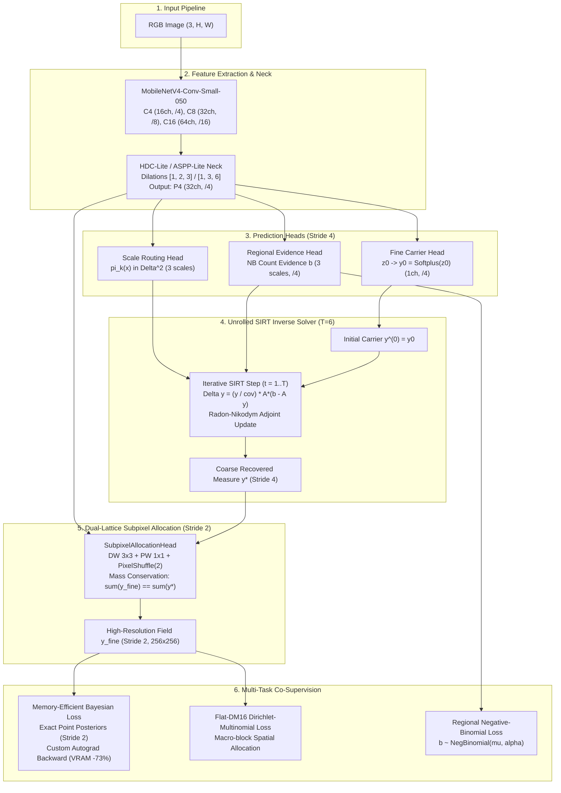

# RMR-v3 (Radon Measure Recovery) Codebase Explanation & Technical Guide

Welcome to the comprehensive code explanation documentation for **RMR-v3 (Reliability-Weighted Regional Measure Reconciliation)**. This documentation breaks down the architecture, mathematical formulations, optimization techniques, and implementation details of the codebase.

---

## 1. System Overview & Core Scientific Paradigm

Standard crowd counting models treat the task as pure density map regression:
$$\mathcal{L}_{\text{MSE}} = \| \hat{D} - D_{\text{GT}} \|_2^2$$
However, at Stride 4 ($128 \times 128$ for $512 \times 512$ inputs), adjacent heads closer than $4\text{ px}$ merge into a single cell, leading to severe **Density Saturation** and **Information Loss**.

**RMR-v3** reconceptualizes crowd counting as a **Fredholm Integral Equation of the First Kind**:
$$b = \mathcal{A} y + \eta$$
where:
* $y \in \mathcal{M}_+(\Omega)$ is the continuous underlying Radon density measure on image domain $\Omega$.
* $\mathcal{A}: \mathcal{M}_+(\Omega) \to \mathbb{R}^M$ is a multiscale box integration observation operator measuring regional headcount evidence over windows $\mathcal{B} \in \{32, 64, 128\}\text{ px}$.
* $b \in \mathbb{R}^M$ represents probabilistic regional count observations modeled via Negative-Binomial distributions.
* $\eta$ is observational and perspective noise.

To recover $y$, RMR-v3 employs an **Unrolled SIRT (Simultaneous Iterative Reconstruction Technique) Solver** ($T=6$ iterations) governed by a **Radon-Nikodym Adjoint Operator** $\mathcal{A}^*$, paired with a **Subpixel Allocation Lattice** (Stride 2) preserving exact discrete mass conservation.

---

## 2. Global Architecture Flow



---

## 3. Directory Structure & Code Organization

The codebase is organized into modular layers ensuring high cohesion and strict parameter budget ($\le 104,441$ parameters):

```text
lightweightcrcn/
├── rmr_v3/                     # Primary RMR-v3 Research Package
│   ├── model/                  # Model definition & modular components
│   │   ├── canonical.py        # RMRv3Canonical: Core neural network & solver loop
│   │   ├── architecture.py     # RMRv3: High-level wrapper & inference interface
│   │   ├── backbone.py         # MobileNetV4-Conv-Small-050 backbone wrapper
│   │   ├── neck.py             # ASPP-Lite & HDC-Lite multi-scale necks
│   │   ├── evidence.py         # Probabilistic regional head & hurdle gating
│   │   ├── solver_step.py      # Unrolled SIRT solver step & Morozov principle
│   │   ├── scale_routing.py    # Spatial scale routing head
│   │   └── config.py           # RMRv3Config dataclass
│   ├── losses/                 # Point supervision & loss orchestration
│   │   ├── point_supervision.py# Bayesian loss, custom autograd backward, adaptive sigma
│   │   ├── orchestration.py    # Multi-task loss combination & decoupled supervision
│   │   ├── dual_supervision.py # Dual-measure fine supervision pipeline
│   │   └── config.py           # RMRv3LossConfig dataclass
│   ├── optim/                  # Optimization & scheduling infrastructure
│   │   ├── safe_prodigy.py     # Distance-adaptive SafeProdigy optimizer
│   │   ├── wsd_scheduler.py    # Warmup-Stable-Decay learning rate scheduler
│   │   └── builder.py          # Optimizer & scheduler builders
│   ├── trainer.py              # Full training loop, early stopping, logging
│   └── train.py                # CLI entry point, argument parsing, determinism
├── rmr_core/                   # Shared low-level primitives & dataset logic
│   ├── data.py                 # Manifest loading, dynamic padding, augmentation
│   ├── heads.py                # SubpixelAllocationHead, FineMeasureHead
│   ├── types.py                # Core dataclasses: RegionSet, ForwardOutputs
│   ├── metrics.py              # MAE, MSE, RMSE, GAME(0,1,2,3) evaluations
│   └── evaluation.py           # Tiled prediction & sliding window evaluation
├── configs/rmr_research/       # Formal experiment configuration files
└── tests/rmr_v3/               # Exhaustive unit & integration tests (521+ tests)
```

---

## 4. Documentation Index

Detailed module-by-module walkthroughs are divided into four dedicated guides:

1. **[01. Model Architecture & Forward Flow](file:///f:/lightweightcrcn/docs/code_explanation/01_model_architecture_and_forward_flow.md)**
   * MobileNetV4 stem & stages, HDC-Lite vs ASPP-Lite neck.
   * Fine carrier head, Regional evidence head, and Scale routing head.
   * Dual-Lattice Subpixel Stride 2 allocation with discrete mass conservation.
   * Parameter budgeting breakdown ($104,359 \le 104,441$).

2. **[02. Unrolled Inverse Solver & Mathematical Foundations](file:///f:/lightweightcrcn/docs/code_explanation/02_unrolled_inverse_solver.md)**
   * Fredholm Type-1 formulation and unrolled SIRT algorithm ($T=6$).
   * Radon-Nikodym adjoint operator $\mathcal{A}^*$ and zero-support mitigation.
   * Spatial Morozov discrepancy principle for noise-aware stopping.
   * Lipschitz continuity and monotonic contraction mapping guarantees.

3. **[03. Loss Functions & High-Efficiency Point Supervision](file:///f:/lightweightcrcn/docs/code_explanation/03_loss_functions_and_point_supervision.md)**
   * Canonical Bayesian Loss formulation (Ma et al. ICCV 2019).
   * Custom Autograd Backward eliminating $\mathcal{O}(B \cdot N \cdot M)$ graph retention (reducing VRAM from $3,570\text{ MB}$ to $960\text{ MB}$).
   * $k$-NN adaptive Gaussian sharpness $\sigma \in [1.5, 3.5]$.
   * Flat-DM16 Dirichlet-Multinomial macro-block supervision.
   * Decoupled gradient coordination preventing carrier suppression.

4. **[04. Data Pipeline, Training Engine & Numerical Stability](file:///f:/lightweightcrcn/docs/code_explanation/04_data_pipeline_and_training_engine.md)**
   * Data loading, aspect-ratio preservation, and dynamic reflection padding.
   * Deterministic training harness and multi-worker isolation.
   * Exponential Moving Average (EMA) parameter stabilization.
   * Safe learning rate scheduling, gradient clipping, and checkpoint management.
